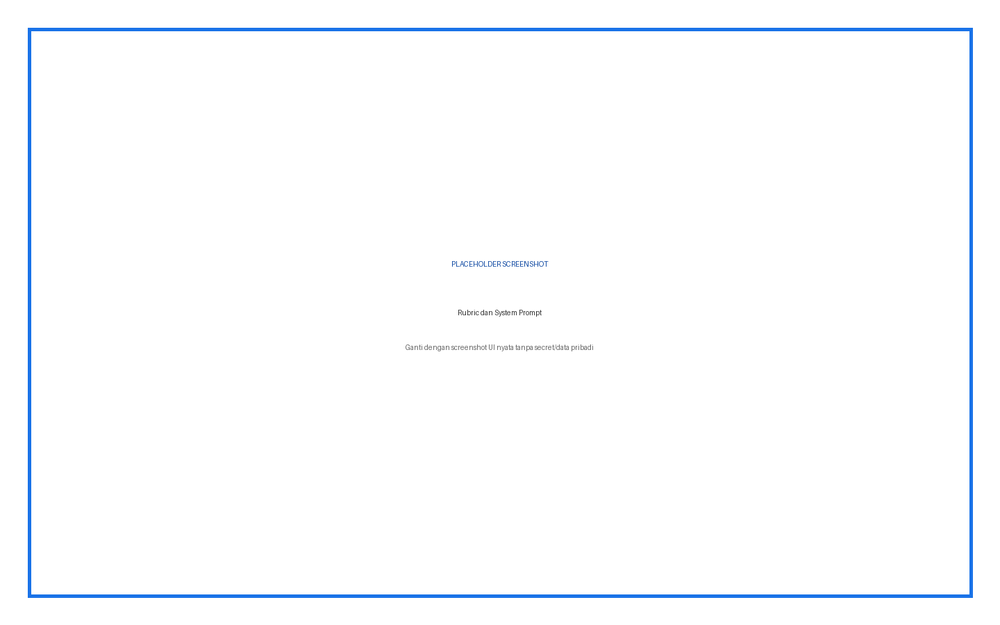
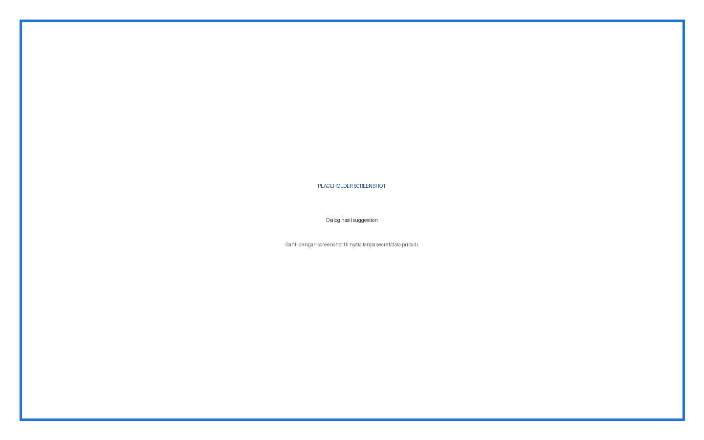
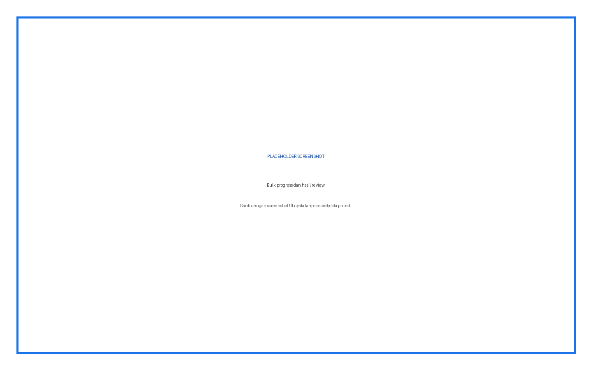
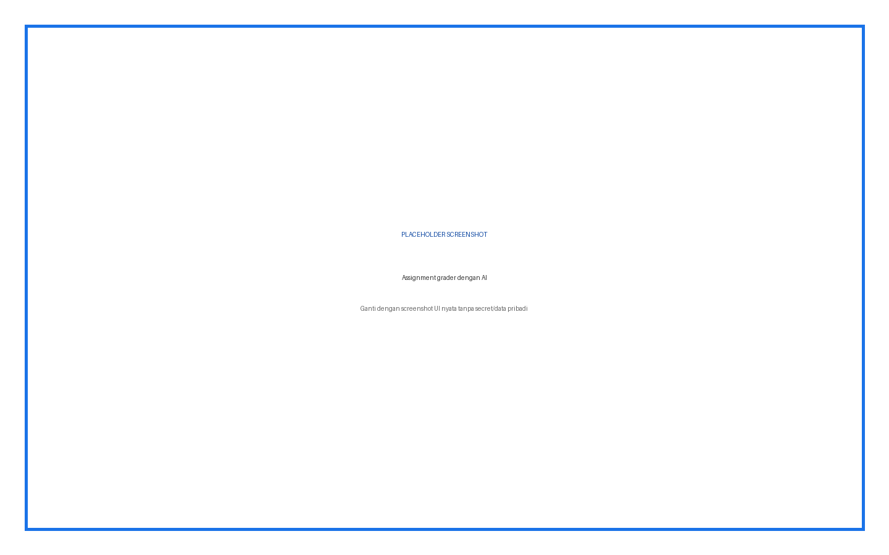
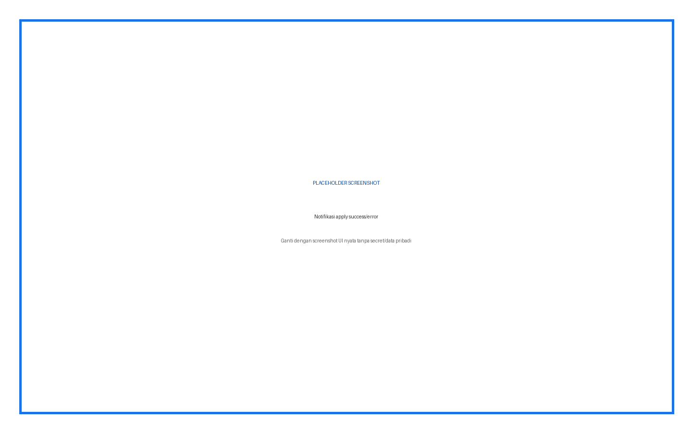

# AI Grading — Panduan Pengguna Lengkap

Plugin menyisipkan bantuan penilaian AI pada manual grading Quiz essay dan grading Assignment. Semua saran harus direview guru.

## Daftar Isi

1. Ringkasan fitur dan role
2. Instalasi
3. Konfigurasi admin
4. Penjelasan setiap input
5. Prosedur penggunaan langkah demi langkah
6. Hasil dan status
7. Troubleshooting
8. Keamanan dan data
9. Versi dan kompatibilitas

## Ringkasan Fitur dan Role

| Role | Fitur |
|---|---|
| Admin | API, rubrik, prompt, batch, retry |
| Guru | Suggest, review, apply, bulk/auto bila tersedia |
| Peserta | Menerima nilai/feedback hanya setelah diterapkan |

## Cara Membaca Panduan

Setiap prosedur menyebut role, lokasi menu, input, fungsi input, langkah, dan hasil yang harus terlihat. Kotak bertuliskan **PLACEHOLDER SCREENSHOT** sengaja disediakan untuk diganti setelah alur UI final difoto.

## Instalasi

**Role:** Administrator situs.

1. Unduh ZIP plugin yang sesuai.
2. Buka **Site administration > Plugins > Install plugins**.
3. Upload ZIP, klik **Install plugin from ZIP file**, lalu lanjutkan validasi.
4. Klik **Upgrade Moodle database now**.
5. Buka **Site administration > Notifications** dan pastikan tidak ada upgrade tertunda.
6. Buka halaman plugin sesuai panduan untuk memastikan menu dan capability terpasang.

> Peringatan: lakukan backup sebelum upgrade production. Jangan menaruh ZIP plugin dengan folder pembungkus ganda.

## Konfigurasi Admin dan Penjelasan Setiap Input

| Input | Tipe/Default | Fungsi | Kapan digunakan |
|---|---|---|---|
| Dali API Key | Password / kosong | Autentikasi request grading | Wajib agar tombol dirender |
| Dali API Base URL | URL / http://localhost:8000 | Root backend Dali | Sesuaikan environment |
| Test Connection | Button | Uji Base URL dan API key | Setelah konfigurasi |
| Default Rubric | Textarea / rubrik 4 tingkat | Kriteria default penilaian | Sesuaikan kebijakan institusi |
| System Prompt | Textarea / prompt Indonesia | Instruksi format dan relevansi | Ubah hanya setelah pengujian |
| Enable Background Task | Checkbox / nonaktif | Mengalihkan bulk ke background bila implementasi tersedia | Gunakan untuk batch besar |
| Batch Size | Integer / 10 | Jumlah jawaban per batch | Turunkan bila timeout |
| Max Retries | Integer / 3 | Percobaan ulang batch gagal | Naikkan hanya untuk error sementara |

## Prosedur Penggunaan Langkah demi Langkah

### Siapkan soal essay

**Role:** Guru

1. Buka Question Bank dan edit soal Essay
2. Isi question text dan maximum mark
3. Isi Information for graders dengan jawaban acuan dan poin rubrik
4. Simpan soal
5. Pastikan quiz memiliki finished answer yang belum dinilai

**Hasil:** AI menerima konteks penilaian yang cukup.

**Gambar 1.** Placeholder — Settings API.

### Suggest satu jawaban Quiz

**Role:** Guru

1. Buka Quiz > Results > Manual grading
2. Pilih soal/jawaban essay
3. Klik AI Suggest Grade bila tombol tampil
4. Tunggu grade, feedback, explanation, confidence
5. Bandingkan dengan rubrik dan jawaban acuan
6. Edit bila perlu
7. Klik Apply Grade hanya setelah review

**Hasil:** Nilai diterapkan pada jawaban yang dipilih.

**Gambar 2.** Placeholder — Rubric dan System Prompt.

### Bulk suggestion Quiz

**Role:** Guru

1. Atur halaman agar hanya jawaban target yang tampil
2. Klik Bulk AI Grade All
3. Konfirmasi scope
4. Pantau progress
5. Review semua hasil
6. Terapkan satu per satu atau Apply All hanya bila benar

**Hasil:** Semua jawaban target mendapat draft saran; nilai asli berubah hanya setelah apply.

**Gambar 3.** Placeholder — Manual grading dengan tombol Suggest.

### Auto grade Quiz

**Role:** Guru

1. Pastikan rubrik sudah diuji pada sampel
2. Klik Auto AI Grade untuk satu soal atau Auto Grade ALL Questions untuk seluruh quiz bila tombol tersedia
3. Baca dialog scope dengan teliti
4. Konfirmasi hanya pada fixture/disposable
5. Periksa ringkasan success/failed dan audit nilai

**Hasil:** Mode auto dapat menerapkan nilai langsung; selalu lakukan sampling setelah selesai.

**Gambar 4.** Placeholder — Dialog hasil suggestion.

### Grading Assignment

**Role:** Guru

1. Buka Assignment > View all submissions atau Grade
2. Pilih submission
3. Klik kontrol AI yang dirender
4. Pastikan file/online text dapat diekstrak
5. Review suggestion dan feedback
6. Terapkan melalui form grading Moodle

**Hasil:** Submission menerima nilai/feedback setelah guru menyimpan.

**Gambar 5.** Placeholder — Bulk progress dan hasil review.

## Memahami Output AI

| Output | Fungsi | Tindakan guru |
|---|---|---|
| Suggested grade | Nilai numerik pada skala maksimum soal | Pastikan skala benar dan cocokkan rubrik |
| Feedback | Teks yang dapat diberikan kepada peserta | Hapus klaim salah atau data sensitif |
| Explanation | Alasan internal untuk guru | Gunakan untuk review; jangan otomatis publikasikan |
| Confidence | Tingkat keyakinan model bila tersedia | Confidence tinggi tetap bukan jaminan benar |

## Batas Aman Operasional

- **Suggest** adalah jalur default karena menyediakan review.
- **Bulk** memperluas scope; filter halaman sebelum menjalankan.
- **Auto** berpotensi langsung mengubah nilai. Gunakan hanya setelah rubrik diuji dan backup/audit tersedia.
- Plugin memproses jawaban peserta melalui backend Dali; pastikan dasar pemrosesan data sesuai kebijakan institusi.

## Troubleshooting

| Masalah | Penyebab/Pemeriksaan | Tindakan |
|---|---|---|
| Tombol tidak muncul | API key kosong, capability, halaman/action salah, tidak ada essay | Perbaiki prasyarat dan refresh |
| Nothing to display | Tidak ada answer essay target | Gunakan quiz dengan finished essay attempts |
| File tidak terbaca | Format/ukuran/isi tidak didukung | Gunakan online text atau file teks yang didukung |
| Nilai terlalu tinggi/rendah | Rubrik atau grader information kabur | Perjelas kriteria dan uji ulang |
| Bulk timeout | Batch terlalu besar/backend lambat | Turunkan batch size |
| Response invalid | Backend tidak mengembalikan format yang diharapkan | Test connection dan periksa log aman |

## Keamanan dan Data

Jangan menaruh API key, password, token, sesskey, data pribadi, jawaban peserta, atau nilai dalam screenshot dan dokumentasi. Semua write-action harus direview sebelum submit.

## Versi dan Kompatibilitas

local_aigrading 1.4.0. Requires Moodle 4.1+ (`2022112800`).

**Gambar 6.** Placeholder — Assignment grader dengan AI.

**Gambar 7.** Placeholder — Notifikasi apply success/error.
