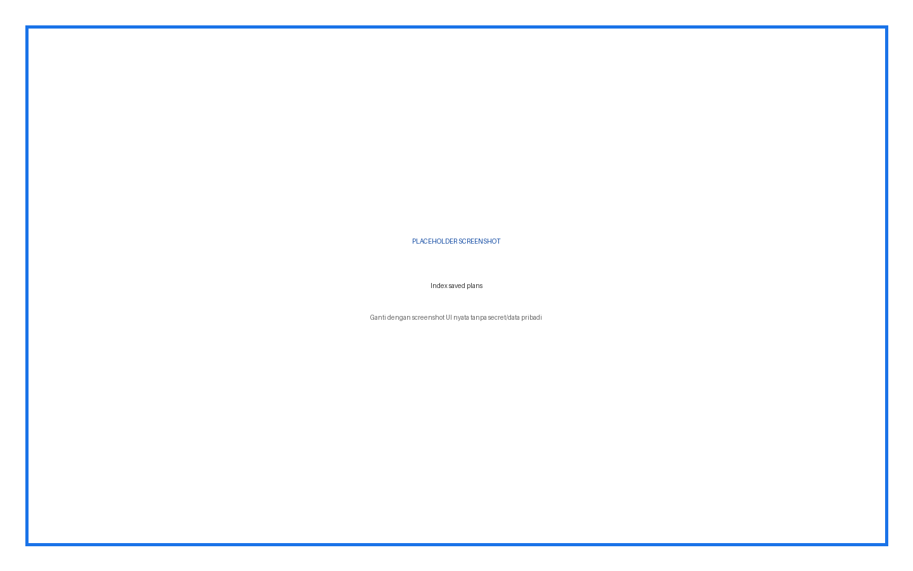
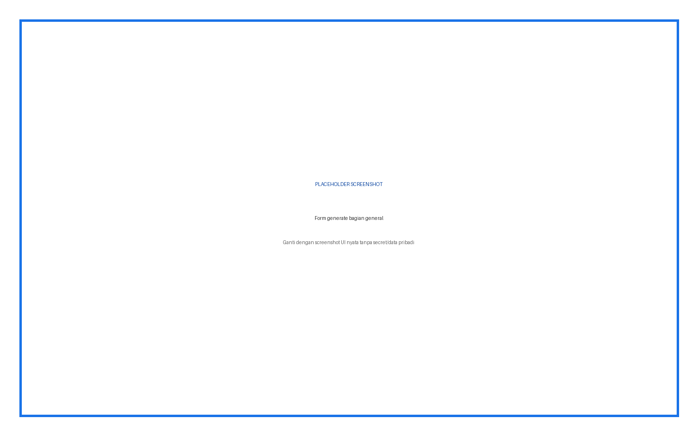
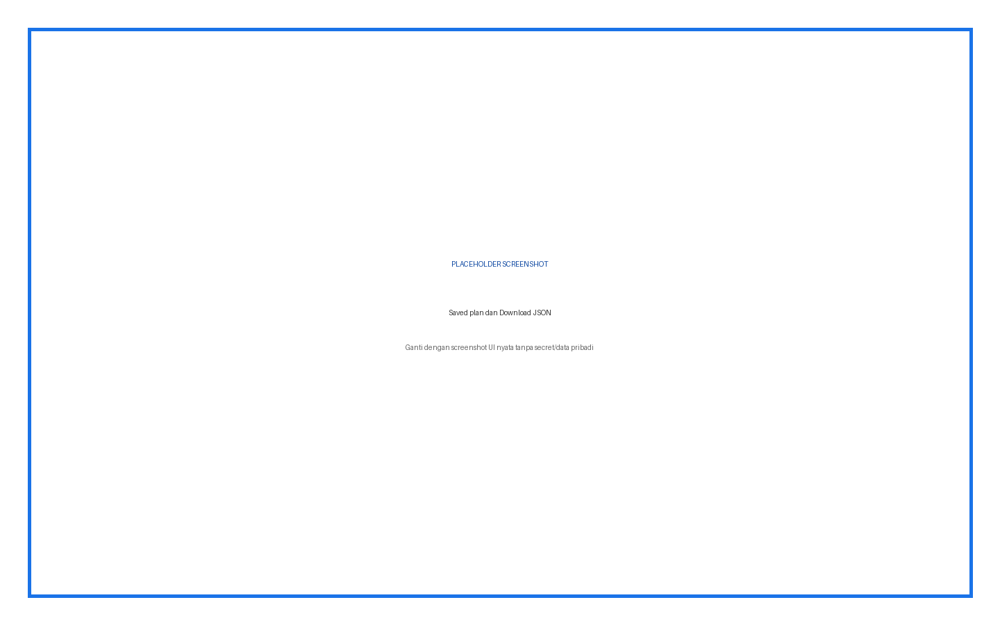
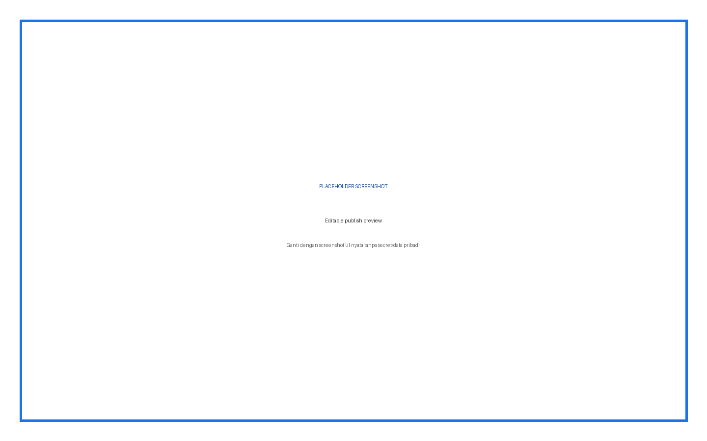
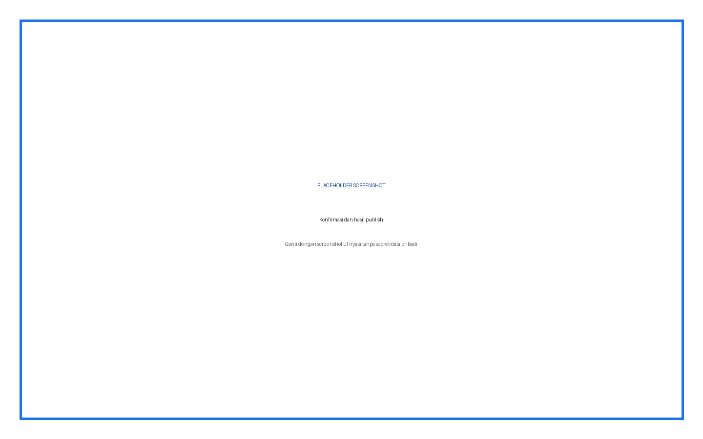

# AI Lesson Plan — Panduan Pengguna Lengkap

Plugin membuat lesson plan, menyimpan draft JSON, menampilkan preview, memungkinkan edit skeleton, download JSON, dan publish section/activity ke course.

## Daftar Isi

1. Ringkasan fitur dan role
2. Instalasi
3. Konfigurasi admin
4. Penjelasan setiap input
5. Prosedur penggunaan langkah demi langkah
6. Hasil dan status
7. Troubleshooting
8. Keamanan dan data
9. Versi dan kompatibilitas

## Ringkasan Fitur dan Role

| Role | Fitur |
|---|---|
| Admin | Base URL, API key, logging |
| Guru | Generate, save, view, edit preview, download, publish |
| Peserta | Melihat activity/section yang dipublish |

## Cara Membaca Panduan

Setiap prosedur menyebut role, lokasi menu, input, fungsi input, langkah, dan hasil yang harus terlihat. Kotak bertuliskan **PLACEHOLDER SCREENSHOT** sengaja disediakan untuk diganti setelah alur UI final difoto.

## Instalasi

**Role:** Administrator situs.

1. Unduh ZIP plugin yang sesuai.
2. Buka **Site administration > Plugins > Install plugins**.
3. Upload ZIP, klik **Install plugin from ZIP file**, lalu lanjutkan validasi.
4. Klik **Upgrade Moodle database now**.
5. Buka **Site administration > Notifications** dan pastikan tidak ada upgrade tertunda.
6. Buka halaman plugin sesuai panduan untuk memastikan menu dan capability terpasang.

> Peringatan: lakukan backup sebelum upgrade production. Jangan menaruh ZIP plugin dengan folder pembungkus ganda.

## Konfigurasi Admin dan Penjelasan Setiap Input

| Input | Tipe/Default | Fungsi | Kapan digunakan |
|---|---|---|---|
| Dali API Base URL | URL / http://localhost:8000 | Root backend lesson plan | Sesuaikan environment |
| Dali API Key | Password / kosong | Autentikasi request generate | Wajib; plugin dapat fallback ke key Dali Widget |
| Enable Logging | Checkbox / aktif | Mencatat penggunaan plugin | Aktif untuk audit |

## Prosedur Penggunaan Langkah demi Langkah

### Generate lesson plan

**Role:** Guru

1. Buka course > AI Lesson Plan
2. Klik Generate Lesson Plan
3. Isi seluruh parameter form
4. Pilih konteks course yang boleh dikirim
5. Aktifkan knowledge source hanya bila source ready
6. Klik Generate Lesson Plan
7. Tunggu preview dan baca seluruh section/activity

**Hasil:** Preview plan tampil; belum mengubah course.

**Gambar 1.** Placeholder — Settings tanpa API key terlihat.

### Simpan draft

**Role:** Guru

1. Pada preview hasil, periksa title, objectives, section, activity, assessment
2. Klik Save Plan
3. Tunggu notifikasi sukses
4. Kembali ke daftar plan

**Hasil:** Record draft muncul pada index course.

**Gambar 2.** Placeholder — Index saved plans.

### Lihat dan download JSON

**Role:** Guru

1. Buka plan dari daftar
2. Periksa plan yang dirender
3. Klik Download JSON
4. Buka file dan pastikan JSON dapat dibaca

**Hasil:** File JSON berisi struktur plan tersimpan.

**Gambar 3.** Placeholder — Form generate bagian general.

### Preview publish

**Role:** Guru

1. Pada view plan pilih placement append/update dan start section bila tersedia
2. Klik Preview Publish
3. Periksa setiap target section
4. Edit title, summary, objectives, assessment
5. Centang hanya activity yang akan dipublish
6. Pilih activity type dan edit title/purpose/body

**Hasil:** Belum ada perubahan course; UI menampilkan skeleton final.

**Gambar 4.** Placeholder — Form include course context/source.

### Publish ke course

**Role:** Guru

1. Pastikan course disposable atau backup tersedia
2. Review ulang placement dan activity selection
3. Klik Publish dan konfirmasi
4. Tunggu notifikasi jumlah section/activity created/updated
5. Buka course dan periksa hasil

**Hasil:** Course berubah sesuai preview; plan menyimpan status published.

**Gambar 5.** Placeholder — Preview hasil AI.

## Penjelasan Setiap Input Generate

| Input | Default/Pilihan | Fungsi |
|---|---|---|
| Topic / subject focus | Kosong | Fokus utama lesson plan; tulis outcome dan batas materi. |
| Learner level | Beginner / mixed ability; 9 opsi | Menentukan kompleksitas, dari basic education sampai professional. |
| Duration per meeting | `2 x 50 menit` | Durasi tekstual yang dipakai AI merancang aktivitas. |
| Number of meetings | 4; pilihan 1-5 | Jumlah pertemuan/section yang diminta. |
| Language | Indonesian | Bahasa seluruh plan. |
| Activity density | Balanced | Mengatur banyaknya activity: light, balanced, atau intensive sesuai opsi UI. |
| Curriculum reference | Kosong | Standar, capaian, silabus, atau referensi kurikulum yang harus diikuti. |
| Include course metadata | Aktif | Mengirim nama/deskripsi/metadata course. |
| Include sections | Aktif | Mengirim section existing agar plan selaras struktur course. |
| Include activities | Aktif | Mengirim activity existing untuk menghindari duplikasi dan memberi konteks. |
| Include knowledge source | Nonaktif | Mengambil konteks RAG dari satu source ready. |
| Knowledge source | Kosong | Memilih source khusus ketika Include source aktif. |
| Additional instructions | Kosong | Aturan format, pedagogi, assessment, aksesibilitas, atau larangan. |

## Penjelasan Input Preview Publish

| Input | Fungsi |
|---|---|
| Publish placement | Append section baru atau update target existing sesuai opsi UI |
| Start section | Nomor awal target section |
| Section title/summary/objectives/assessment | Konten section final sebelum publish |
| Publish activity checkbox | Memilih activity yang benar-benar dibuat/diubah |
| Activity type | Label, Page, Forum, Assignment, Quiz, URL, SCORM, Book, Choice, Feedback, Glossary, Wiki |
| Activity title | Nama activity pada course |
| Purpose | Tujuan internal/pedagogis activity |
| Activity body | Instruksi atau konten sesuai tipe activity |

## Troubleshooting

| Masalah | Penyebab/Pemeriksaan | Tindakan |
|---|---|---|
| API key kosong | Tidak ada key plugin maupun Dali Widget | Admin mengisi key |
| Generate error | Backend tidak aktif/response invalid | Periksa Base URL, key, dan error aktual |
| Source kosong | Tidak ada knowledge source ready | Sinkronkan melalui Dali Widget |
| Plan tidak tersimpan | Action save gagal atau JSON invalid | Kembali ke preview dan periksa error |
| Publish ditolak | Capability manage activities kurang | Perbaiki role/capability |
| Activity hasil tidak sesuai | AI output belum diedit | Edit preview sebelum publish |

## Keamanan dan Data

Jangan menaruh API key, password, token, sesskey, data pribadi, jawaban peserta, atau nilai dalam screenshot dan dokumentasi. Semua write-action harus direview sebelum submit.

## Versi dan Kompatibilitas

local_ailessonplan 0.1.0. Requires Moodle 4.1+ (`2022112800`).

**Gambar 6.** Placeholder — Saved plan dan Download JSON.

**Gambar 7.** Placeholder — Editable publish preview.

**Gambar 8.** Placeholder — Konfirmasi dan hasil publish.
