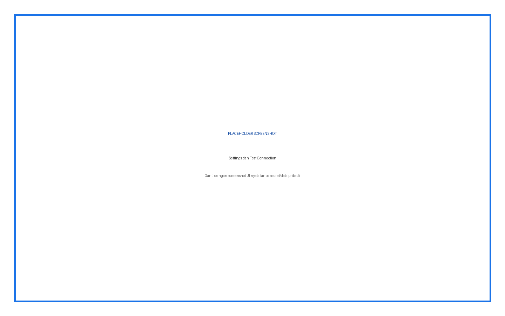
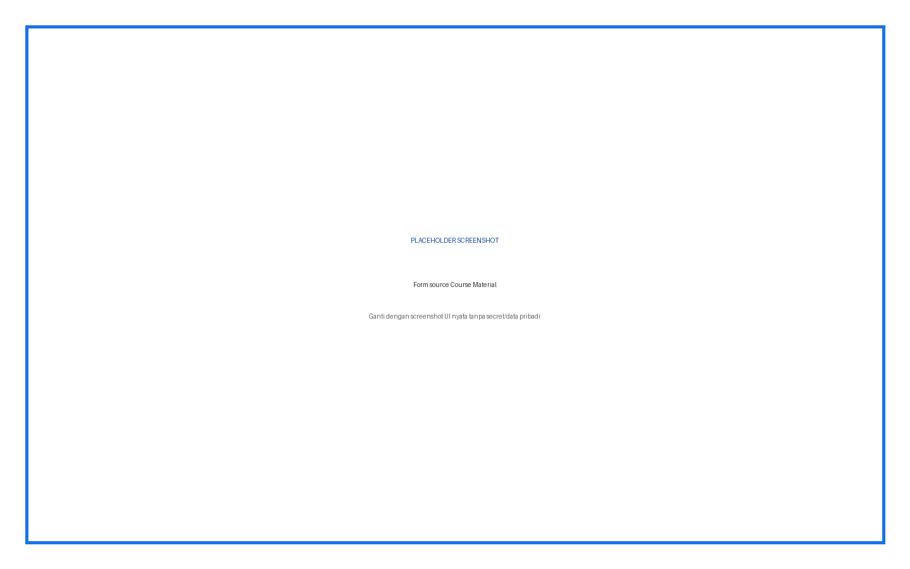
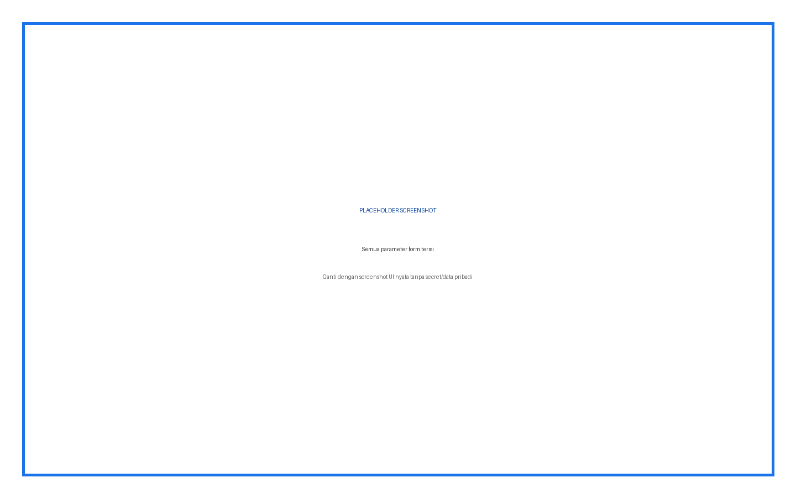
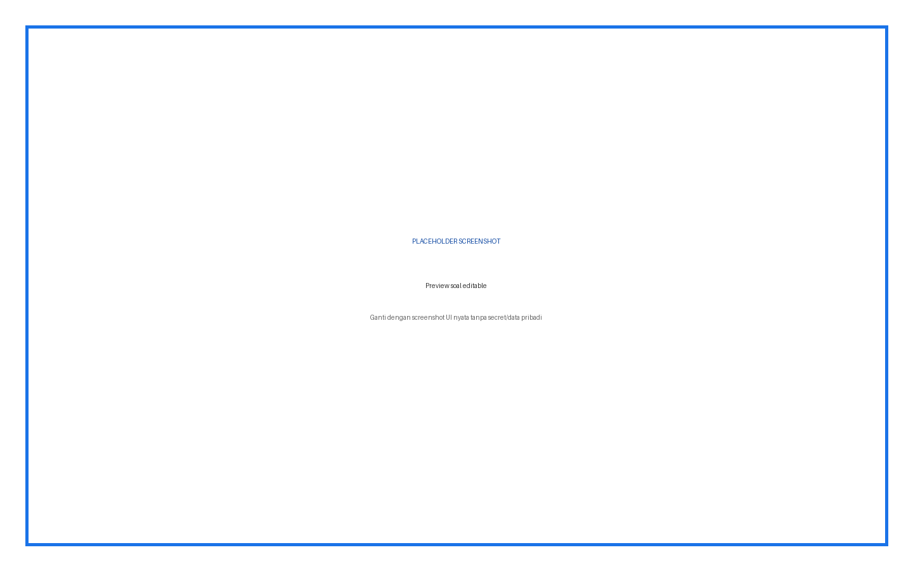
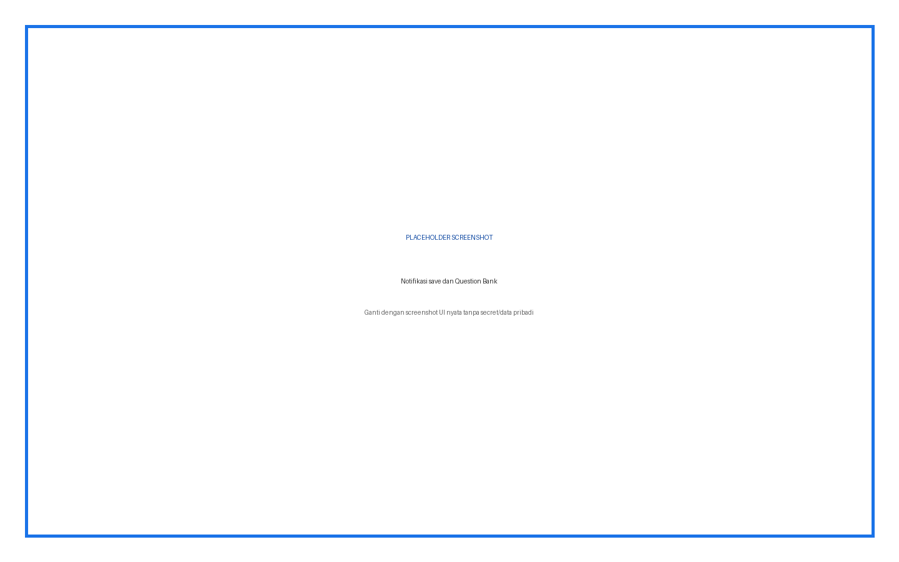

# AI Quiz Generator — Panduan Pengguna Lengkap

Plugin membuat dan mereview soal dari topik, PDF, atau source Knowledge Base, lalu menyimpan soal terpilih ke Question Bank.

## Daftar Isi

1. Ringkasan fitur dan role
2. Instalasi
3. Konfigurasi admin
4. Penjelasan setiap input
5. Prosedur penggunaan langkah demi langkah
6. Hasil dan status
7. Troubleshooting
8. Keamanan dan data
9. Versi dan kompatibilitas

## Ringkasan Fitur dan Role

| Role | Fitur |
|---|---|
| Admin | API, test connection, batas soal, logging |
| Guru | Generate, edit preview, pilih kategori, simpan soal |
| Peserta | Tidak memakai generator; mengerjakan quiz yang dibuat |

## Cara Membaca Panduan

Setiap prosedur menyebut role, lokasi menu, input, fungsi input, langkah, dan hasil yang harus terlihat. Kotak bertuliskan **PLACEHOLDER SCREENSHOT** sengaja disediakan untuk diganti setelah alur UI final difoto.

## Instalasi

**Role:** Administrator situs.

1. Unduh ZIP plugin yang sesuai.
2. Buka **Site administration > Plugins > Install plugins**.
3. Upload ZIP, klik **Install plugin from ZIP file**, lalu lanjutkan validasi.
4. Klik **Upgrade Moodle database now**.
5. Buka **Site administration > Notifications** dan pastikan tidak ada upgrade tertunda.
6. Buka halaman plugin sesuai panduan untuk memastikan menu dan capability terpasang.

> Peringatan: lakukan backup sebelum upgrade production. Jangan menaruh ZIP plugin dengan folder pembungkus ganda.

## Konfigurasi Admin dan Penjelasan Setiap Input

| Input | Tipe/Default | Fungsi | Kapan digunakan |
|---|---|---|---|
| Dali API Base URL | URL / http://localhost:8000 | Endpoint backend AI | Sesuaikan server Dali |
| Dali API Key | Password / kosong | Autentikasi backend | Wajib sebelum form generate |
| Test Connection | Button | Memeriksa koneksi dan credential | Jalankan setelah perubahan |
| Maximum Questions per Request | Integer / 20 | Batas tertinggi pilihan jumlah soal | Turunkan untuk membatasi beban |
| Enable Logging | Checkbox / aktif | Mencatat aktivitas generate | Aktif untuk audit |

## Prosedur Penggunaan Langkah demi Langkah

### Generate dari topik

**Role:** Guru

1. Buka course > AI Quiz Generator
2. Isi Topic secara spesifik
3. Pilih Source Upload; PDF boleh dikosongkan bila topic terisi
4. Pilih jumlah, tipe, difficulty, language, category
5. Isi Additional Instructions bila perlu
6. Klik Generate Questions

**Hasil:** Backend mengembalikan preview soal.

**Gambar 1.** Placeholder — Settings dan Test Connection.

### Generate dari PDF

**Role:** Guru

1. Pilih Upload new PDF file
2. Upload satu PDF teks maksimal 10 MB
3. Topic boleh menambah fokus
4. Lengkapi parameter soal
5. Generate dan tunggu preview

**Hasil:** Pertanyaan dibuat berdasarkan teks PDF dan instruksi.

**Gambar 2.** Placeholder — Form source Upload.

### Generate dari course material

**Role:** Guru

1. Pastikan Dali Widget source berstatus ready
2. Pilih Select from course materials
3. Pilih source dari dropdown
4. Isi topic sebagai query/fokus
5. Lengkapi parameter lalu generate

**Hasil:** RAG mengambil konteks dari source terpilih.

**Gambar 3.** Placeholder — Form source Course Material.

### Review dan simpan

**Role:** Guru

1. Baca setiap question text
2. Periksa question type dan semua answer
3. Pilih correct answer yang tepat
4. Edit feedback bila tersedia
5. Hapus atau jangan simpan soal buruk
6. Klik Save to Question Bank
7. Buka Question Bank dari tombol hasil

**Hasil:** Notifikasi menyebut jumlah soal tersimpan; soal muncul pada kategori tujuan.

**Gambar 4.** Placeholder — Semua parameter form terisi.

## Penjelasan Setiap Input Form Generate

| Input | Default/Pilihan | Fungsi dan cara isi |
|---|---|---|
| Topic / Subject | Kosong | Fokus materi. Wajib bila tidak ada PDF/source; tulis spesifik dan sesuai level peserta. |
| Source | Upload / Course materials | Menentukan asal konteks. Upload menampilkan file manager; Course menampilkan source ready. |
| Upload PDF Document | 1 PDF, max 10 MB | Dokumen teks sumber. Scan gambar tanpa OCR dapat menghasilkan konteks kosong. |
| Select Source | Source ready | Memilih satu source Knowledge Base course berdasarkan ULID. |
| Number of Questions | 5; 1 sampai batas admin | Jumlah draft yang diminta. Lebih banyak berarti review lebih lama. |
| Question Type | Multiple Choice | Multiple choice, True/False, Short Answer, atau Essay. |
| Difficulty Level | Medium | Easy, Medium, Hard; instruksi tingkat kesulitan untuk AI. |
| Language | Indonesian | Bahasa pertanyaan, jawaban, dan feedback. |
| Question Category | Kategori pertama | Lokasi penyimpanan Question Bank; periksa context agar tidak salah course. |
| Additional Instructions | Kosong | Batas cakupan, gaya, target kelas, jumlah opsi, atau larangan tertentu. |

### Validasi Form

Form menerima **topic atau source content**. Pada mode course, source harus dipilih. Pada mode upload, file harus valid bila topic kosong.

## Troubleshooting

| Masalah | Penyebab/Pemeriksaan | Tindakan |
|---|---|---|
| API key is not configured | Credential kosong | Admin mengisi API key |
| Source list kosong | Belum ada source ready | Sinkronkan materi dan tunggu ready |
| PDF ditolak | Bukan PDF/lebih 10 MB/tidak ada teks | Gunakan satu PDF teks yang valid |
| Category kosong | Tidak ada kategori pada context course/system | Buat kategori Question Bank |
| Generate gagal | Backend atau response invalid | Test connection dan baca error aktual |
| Soal salah | Output AI belum direview | Edit atau jangan simpan |

## Keamanan dan Data

Jangan menaruh API key, password, token, sesskey, data pribadi, jawaban peserta, atau nilai dalam screenshot dan dokumentasi. Semua write-action harus direview sebelum submit.

## Versi dan Kompatibilitas

local_aiquizgen 1.1.0. Requires Moodle 4.1+ (`2022112800`).

**Gambar 5.** Placeholder — Preview soal editable.

**Gambar 6.** Placeholder — Notifikasi save dan Question Bank.
