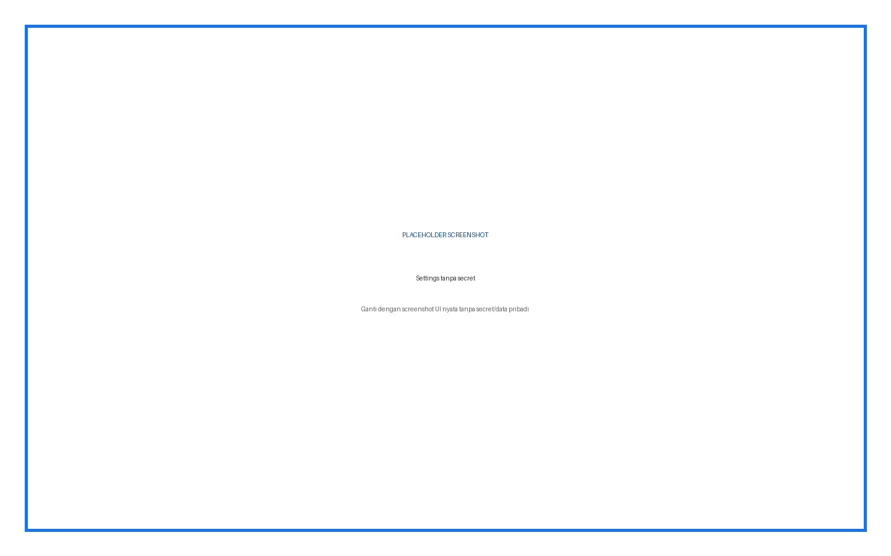
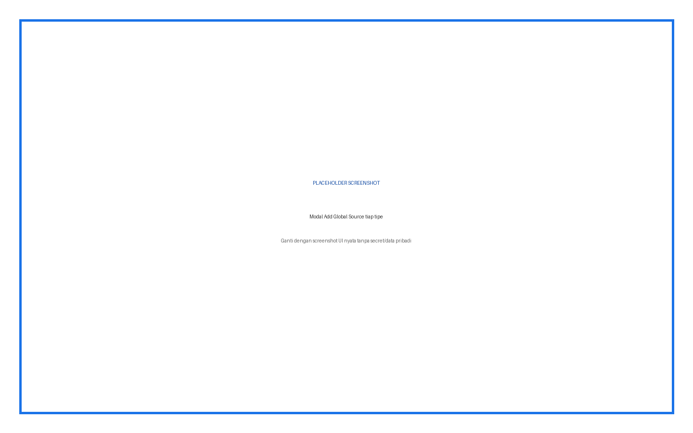
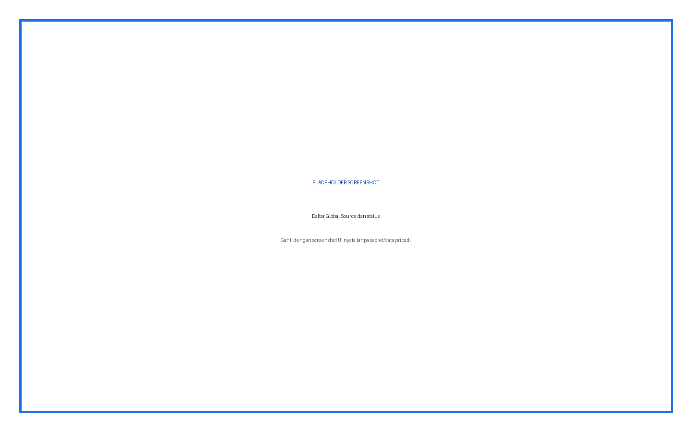
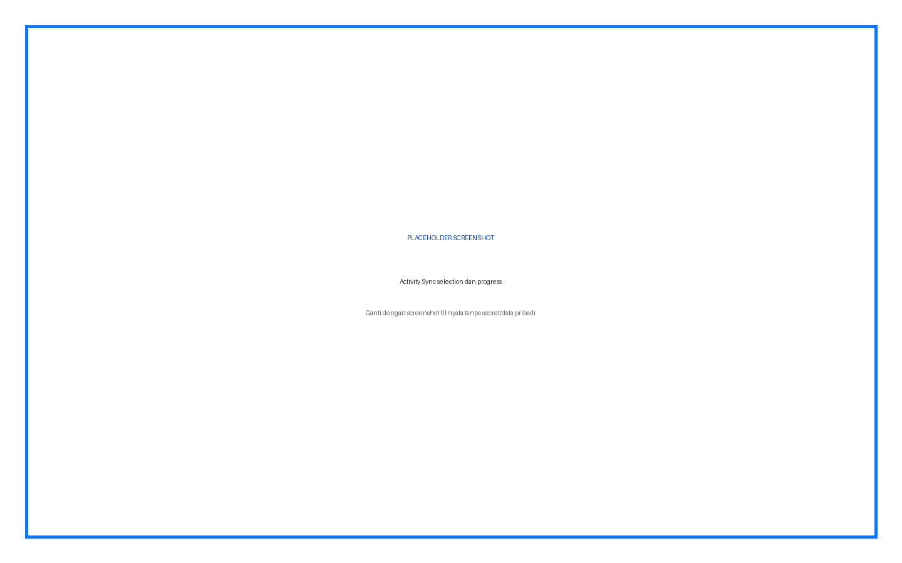
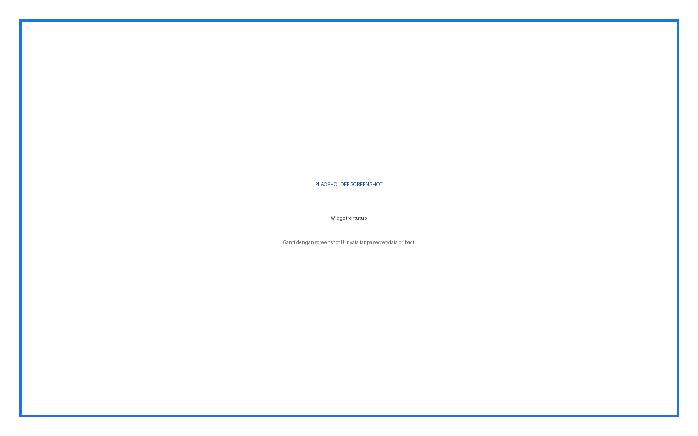
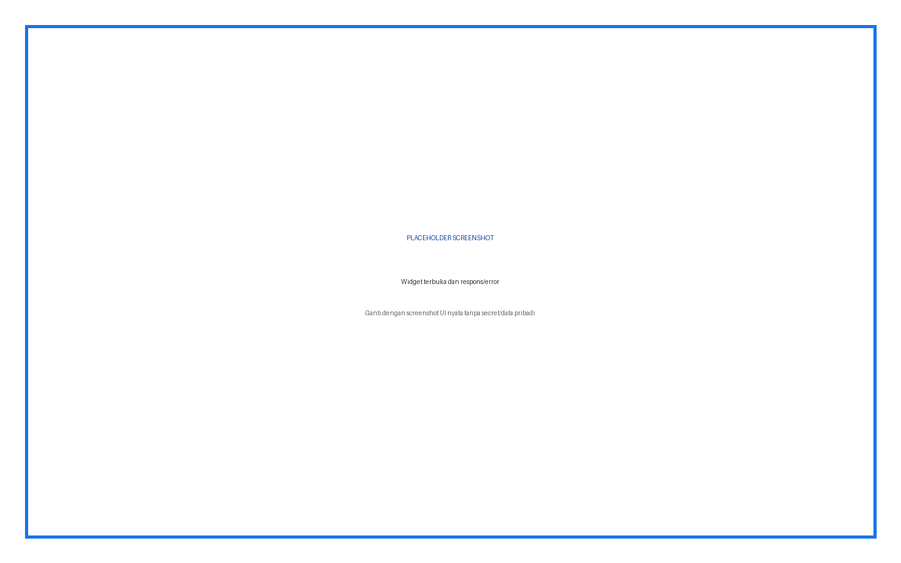

# Dali AI Widget — Panduan Pengguna Lengkap

Plugin menyediakan widget chat kontekstual, Global Knowledge Base, Knowledge Base per-course, upload source, web/YouTube/media/SCORM/custom text, dan sinkronisasi activity.

## Daftar Isi

1. Ringkasan fitur dan role
2. Instalasi
3. Konfigurasi admin
4. Penjelasan setiap input
5. Prosedur penggunaan langkah demi langkah
6. Hasil dan status
7. Troubleshooting
8. Keamanan dan data
9. Versi dan kompatibilitas

## Ringkasan Fitur dan Role

| Role | Fitur |
|---|---|
| Admin | Konfigurasi API, global source, retry/delete, debug |
| Guru | Source course dan activity sync |
| Peserta | Chat melalui widget pada halaman yang diizinkan |

## Cara Membaca Panduan

Setiap prosedur menyebut role, lokasi menu, input, fungsi input, langkah, dan hasil yang harus terlihat. Kotak bertuliskan **PLACEHOLDER SCREENSHOT** sengaja disediakan untuk diganti setelah alur UI final difoto.

## Instalasi

**Role:** Administrator situs.

1. Unduh ZIP plugin yang sesuai.
2. Buka **Site administration > Plugins > Install plugins**.
3. Upload ZIP, klik **Install plugin from ZIP file**, lalu lanjutkan validasi.
4. Klik **Upgrade Moodle database now**.
5. Buka **Site administration > Notifications** dan pastikan tidak ada upgrade tertunda.
6. Buka halaman plugin sesuai panduan untuk memastikan menu dan capability terpasang.

> Peringatan: lakukan backup sebelum upgrade production. Jangan menaruh ZIP plugin dengan folder pembungkus ganda.

## Konfigurasi Admin dan Penjelasan Setiap Input

| Input | Tipe/Default | Fungsi | Kapan digunakan |
|---|---|---|---|
| Enable Widget | Checkbox / aktif | Sakelar widget seluruh site | Matikan sementara saat maintenance |
| API Key | Password / kosong | Bearer credential ke Dali | Wajib untuk API; simpan rahasia |
| Base URL | URL / https://dali-app.test | Root aplikasi Dali | Sesuaikan environment |
| Max upload size (MB) | Integer / 20 | Batas file sebelum dikirim | Samakan atau lebih kecil dari server API |
| Enable signed URL file sync | Checkbox / nonaktif | Kirim temporary signed URL lebih dahulu | Server Dali harus dapat mengakses Moodle |
| Signed download secret | Password / kosong | HMAC signer URL sementara | Isi panjang dan sama dengan verifier |
| Signed URL base URL | URL / kosong | Override public Moodle URL | Gunakan tunnel/reverse proxy |
| Sync Mode | Select / async | Langsung atau background task | Async untuk file/activity besar |
| Strict Course Mode | Checkbox / nonaktif | Batasi jawaban pada materi course | Aktifkan untuk pembelajaran terfokus |
| Debug Mode | Checkbox / nonaktif | Log/panel diagnostik | Hanya troubleshooting; matikan production |

## Prosedur Penggunaan Langkah demi Langkah

### Konfigurasi koneksi

**Role:** Admin

1. Buka halaman settings plugin
2. Isi Base URL dan API Key
3. Atur upload dan sync mode
4. Konfigurasi signed URL hanya bila diperlukan
5. Simpan lalu buka Global Knowledge Base

**Hasil:** Halaman source dapat memanggil backend tanpa error autentikasi.

**Gambar 1.** Placeholder — Settings tanpa secret.

### Tambah Global Source

**Role:** Admin

1. Buka Global Knowledge Base
2. Klik Add Source
3. Pilih Document, Custom Text, Web URL, YouTube, Video, Audio, atau SCORM
4. Isi title/name/URL/content atau pilih file sesuai tipe
5. Submit dan pantau status

**Hasil:** Source muncul dengan Type, Status, Transport, dan Actions.

**Gambar 2.** Placeholder — Modal Add Global Source tiap tipe.

### Tambah Course Source

**Role:** Guru

1. Buka course > Knowledge Base
2. Periksa scope course pada info box
3. Tambah source melalui tipe yang tersedia
4. Pastikan materi tidak mengandung data pribadi
5. Pantau queued/processing/ready/failed

**Hasil:** Source hanya terkait course tersebut.

**Gambar 3.** Placeholder — Daftar Global Source dan status.

### Sinkronisasi Activity

**Role:** Guru

1. Buka bagian Activity Content Sync
2. Pilih activity yang didukung
3. Klik Sync pada satu activity atau pilih beberapa lalu Sync Selected
4. Gunakan Sync All hanya setelah review
5. Refresh untuk memantau queue

**Hasil:** Activity menjadi knowledge source; progress bertahan setelah refresh.

**Gambar 4.** Placeholder — Course Knowledge Base.

### Menggunakan Widget

**Role:** Peserta/Guru

1. Buka halaman non-quiz
2. Klik floating widget
3. Ketik pertanyaan
4. Kirim dan tunggu respons
5. Lanjutkan pertanyaan dalam percakapan yang sama

**Hasil:** Respons menggunakan konteks halaman/course sesuai konfigurasi.

**Gambar 5.** Placeholder — Activity Sync selection dan progress.

## Tipe Source dan Input

| Tipe | Input utama | Fungsi |
|---|---|---|
| Document | Source type + file | PDF/DOCX/TXT/presentasi sesuai dukungan backend |
| Custom Text | Title + content | Menyimpan teks langsung; content harus cukup panjang |
| Web URL | Name + URL | Backend mengambil konten halaman publik |
| YouTube | YouTube URL | Backend mengambil transcript bila tersedia |
| Video/Audio | File | Mengirim media untuk ekstraksi/transkripsi |
| SCORM | File package | Mengirim paket sebagai knowledge source |

Status umum: **queued** menunggu proses, **processing** sedang diproses, **ready** dapat dipakai, **failed** perlu koreksi/retry. Transport menjelaskan signed URL, file upload, inline text, URL fetch, atau remote URL.

## Troubleshooting

| Masalah | Penyebab/Pemeriksaan | Tindakan |
|---|---|---|
| 401/403 | API key salah atau capability kurang | Perbaiki credential/capability |
| Source failed | Backend menolak format atau input | Baca error aman lalu Retry |
| Queued terus | Moodle cron tidak berjalan pada async | Jalankan dan periksa cron |
| Widget tidak muncul | Disabled, halaman quiz/admin, cache, atau JS | Periksa settings dan console |
| Signed URL fallback | URL tidak dapat diakses backend | Perbaiki public base URL/secret atau gunakan binary upload |

## Keamanan dan Data

Jangan menaruh API key, password, token, sesskey, data pribadi, jawaban peserta, atau nilai dalam screenshot dan dokumentasi. Semua write-action harus direview sebelum submit.

## Versi dan Kompatibilitas

local_daliwidget v1.3.0. Requires Moodle 4.1+ (`2022112800`).

**Gambar 6.** Placeholder — Widget tertutup.

**Gambar 7.** Placeholder — Widget terbuka dan respons/error.
