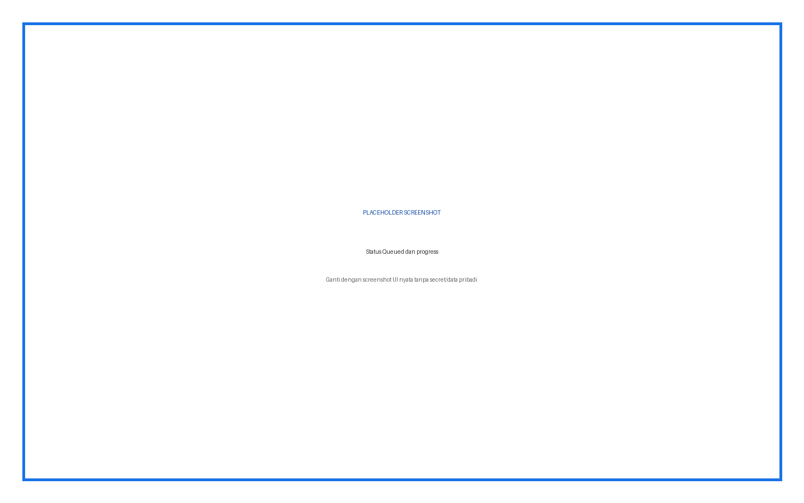
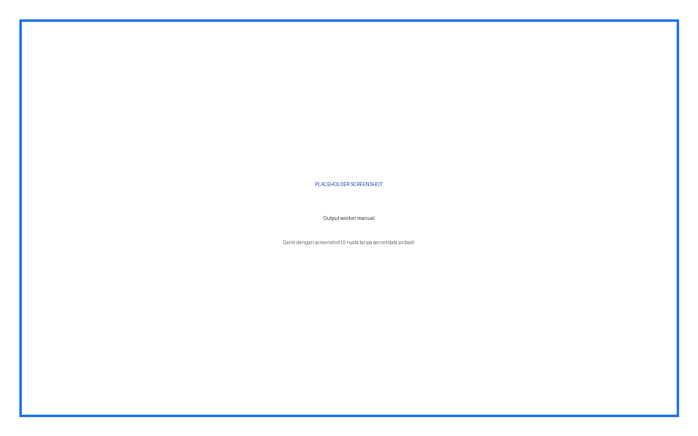
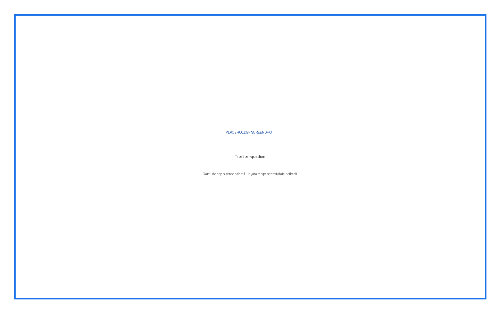
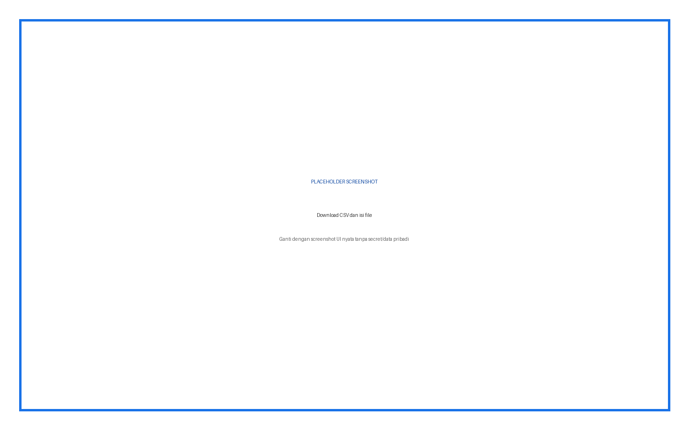
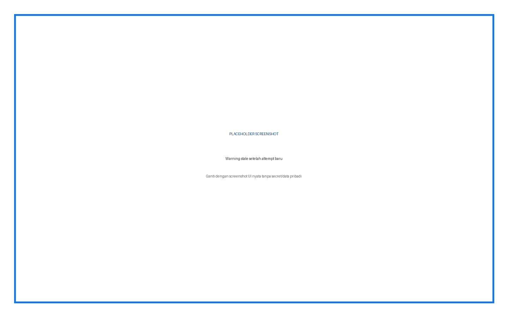

# Light Statistics — Panduan Pengguna Lengkap

Report quiz mandiri berbasis queue dan worker CLI. Hasil disimpan di tabel plugin sendiri dan CSV dibuat dari payload cache tersebut.

## Daftar Isi

1. Ringkasan fitur dan role
2. Instalasi
3. Konfigurasi admin
4. Penjelasan setiap input
5. Prosedur penggunaan langkah demi langkah
6. Hasil dan status
7. Troubleshooting
8. Keamanan dan data
9. Versi dan kompatibilitas

## Ringkasan Fitur dan Role

| Role | Fitur |
|---|---|
| Admin | Install worker OS, monitor failure |
| Guru | Calculate, Recalculate, lihat summary/question table, download CSV |
| Peserta | Tidak memakai report |

## Cara Membaca Panduan

Setiap prosedur menyebut role, lokasi menu, input, fungsi input, langkah, dan hasil yang harus terlihat. Kotak bertuliskan **PLACEHOLDER SCREENSHOT** sengaja disediakan untuk diganti setelah alur UI final difoto.

## Instalasi

**Role:** Administrator situs.

1. Unduh ZIP plugin yang sesuai.
2. Buka **Site administration > Plugins > Install plugins**.
3. Upload ZIP, klik **Install plugin from ZIP file**, lalu lanjutkan validasi.
4. Klik **Upgrade Moodle database now**.
5. Buka **Site administration > Notifications** dan pastikan tidak ada upgrade tertunda.
6. Buka halaman plugin sesuai panduan untuk memastikan menu dan capability terpasang.

> Peringatan: lakukan backup sebelum upgrade production. Jangan menaruh ZIP plugin dengan folder pembungkus ganda.


## Konfigurasi Admin dan Penjelasan Setiap Input

| Input | Tipe/Default | Fungsi | Kapan digunakan |
|---|---|---|---|
| Worker CLI OS | Command / wajib | Mengambil satu queued job dan menghitung | Pasang cron setiap menit |
| Job status | queued/running/complete/failed | Menunjukkan lifecycle kalkulasi | Dipantau dari progress UI/status endpoint |

## Prosedur Penggunaan Langkah demi Langkah

### Pasang worker

**Role:** Admin

1. Pastikan plugin berada di mod/quiz/report/lightstats
2. Selesaikan upgrade dan purge cache
3. Jalankan worker manual sebagai user web server
4. Pastikan output No queued light statistics jobs, bukan fatal error
5. Tambahkan cron OS setiap menit
6. Pastikan lokasi log writable

**Hasil:** Worker siap mengambil satu job per invocation.


**Gambar 1.** Placeholder — Tab Light statistics awal.

### Kalkulasi pertama

**Role:** Guru

1. Buka quiz dengan finished graded attempts
2. Pilih Results > Light statistics
3. Klik Calculate statistics
4. Pastikan status Queued dan progress awal tampil
5. Biarkan worker berjalan
6. Refresh/poll sampai hasil tampil

**Hasil:** Summary dan question statistics berasal dari payload complete.




**Gambar 2.** Placeholder — Status Queued dan progress.

### Recalculate

**Role:** Guru

1. Buka report yang sudah memiliki hasil
2. Jika warning stale muncul, review jumlah attempt baru
3. Klik Recalculate statistics
4. Tunggu worker menyelesaikan job baru
5. Bandingkan attempt count dan summary

**Hasil:** Payload lama diganti hasil baru secara manual.




**Gambar 3.** Placeholder — Output worker manual.

### Download CSV

**Role:** Guru

1. Pastikan job complete
2. Klik Download complete statistics CSV
3. Simpan file
4. Buka sebagai UTF-8 CSV
5. Periksa header summary, question rows, dan response distribution

**Hasil:** Download berasal dari cache; tidak menghitung ulang.


**Gambar 4.** Placeholder — Hasil summary lengkap.

### Monitor worker

**Role:** Admin

1. Periksa cron user web server
2. Jalankan worker manual saat troubleshooting
3. Baca output quiz ID yang selesai
4. Periksa job status/error bila failed
5. Pastikan PHP CLI memakai config.php site yang sama

**Hasil:** Queue bergerak dari queued ke running lalu complete/failed.




**Gambar 5.** Placeholder — Tabel per-question.

## Tidak Ada Form Konfigurasi Global

Light Statistics sengaja tidak memiliki settings page. Konfigurasi operasional berada pada worker OS. Tombol UI hanya membuat job; tombol tidak menjalankan proses berat dalam request browser.

## Command Worker

```bash
sudo -u www-data /usr/bin/php <Moodle dirroot>/mod/quiz/report/lightstats/cli/worker.php
```

Cron minimum:

```cron
* * * * * /usr/bin/php <Moodle dirroot>/mod/quiz/report/lightstats/cli/worker.php >> /var/log/moodle-lightstats.log 2>&1
```

| Bagian command | Fungsi |
|---|---|
| `sudo -u www-data` | Menyamakan user file/database dengan web server |
| `/usr/bin/php` | PHP CLI yang kompatibel dengan Moodle site |
| `<Moodle dirroot>` | Folder yang memuat config.php, admin, mod |
| `worker.php` | Mengambil satu job tertua berstatus queued |
| Redirect log | Menyimpan stdout/stderr untuk troubleshooting |

## Data yang Ditampilkan

Summary mencakup nama quiz/course, jumlah complete graded attempts, average first/all/last/highest, median, standard deviation, skewness, dan coefficient internal consistency bila dapat dihitung. Tabel question mencakup number, type, name, attempts, facility, SD, random guess score, intended/effective weight, discrimination, dan efficiency. CSV juga dapat memuat model response, partial credit, count, frequency.

## Batas Data

Plugin hanya membaca attempt dan question data. Plugin tidak mengubah grade, answer, attempt, `quiz_statistics`, atau `question_statistics`. Job dan JSON hasil disimpan pada `quiz_lightstats_jobs`.

## Troubleshooting

| Masalah | Penyebab/Pemeriksaan | Tindakan |
|---|---|---|
| Queued terus | Cron tidak aktif/path/PHP salah | Jalankan worker manual dan perbaiki cron |
| No queued jobs padahal UI queued | Worker membaca instalasi/database berbeda | Periksa dirroot/config.php |
| Failed | DB, memory, data question, PHP mismatch | Baca error job dan output worker |
| CSV lama | Attempt baru tidak auto invalidate payload | Klik Recalculate dan tunggu worker |
| Tidak ada data | Finished graded attempts tidak tersedia | Selesaikan dan grade attempt fixture |
| Progress polling berhenti | Browser/network/status endpoint | Refresh; worker tetap independen |

## Keamanan dan Data

Jangan menaruh API key, password, token, sesskey, data pribadi, jawaban peserta, atau nilai dalam screenshot dan dokumentasi. Semua write-action harus direview sebelum submit.

## Versi dan Kompatibilitas

quiz_lightstats 2026080200. Requires Moodle 4.1+ (`2022112800`).



**Gambar 6.** Placeholder — Download CSV dan isi file.




**Gambar 7.** Placeholder — Warning stale setelah attempt baru.
