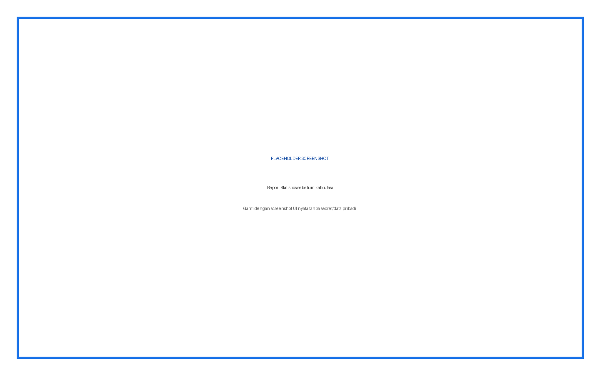
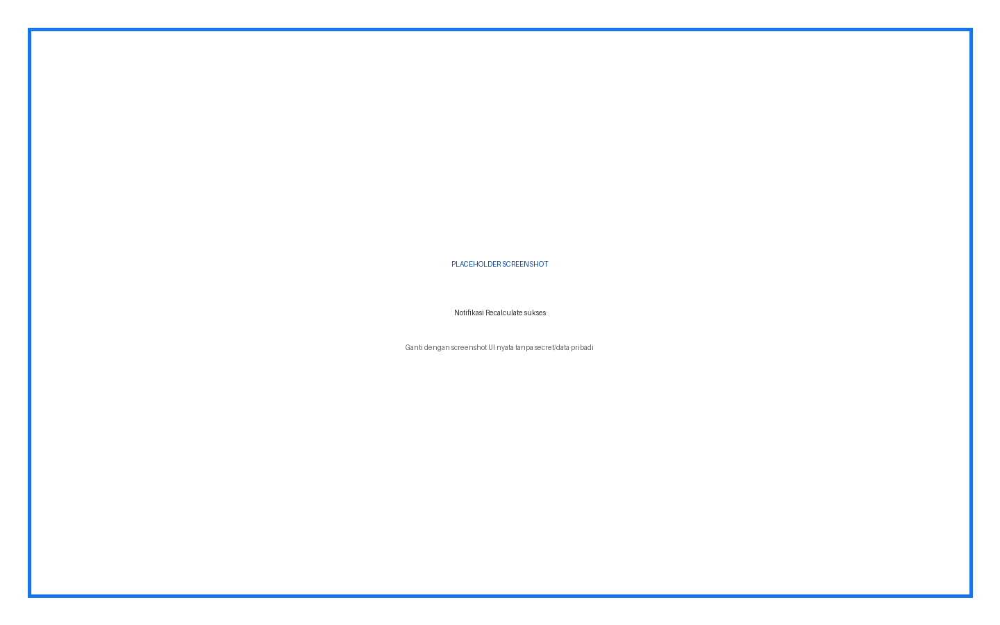
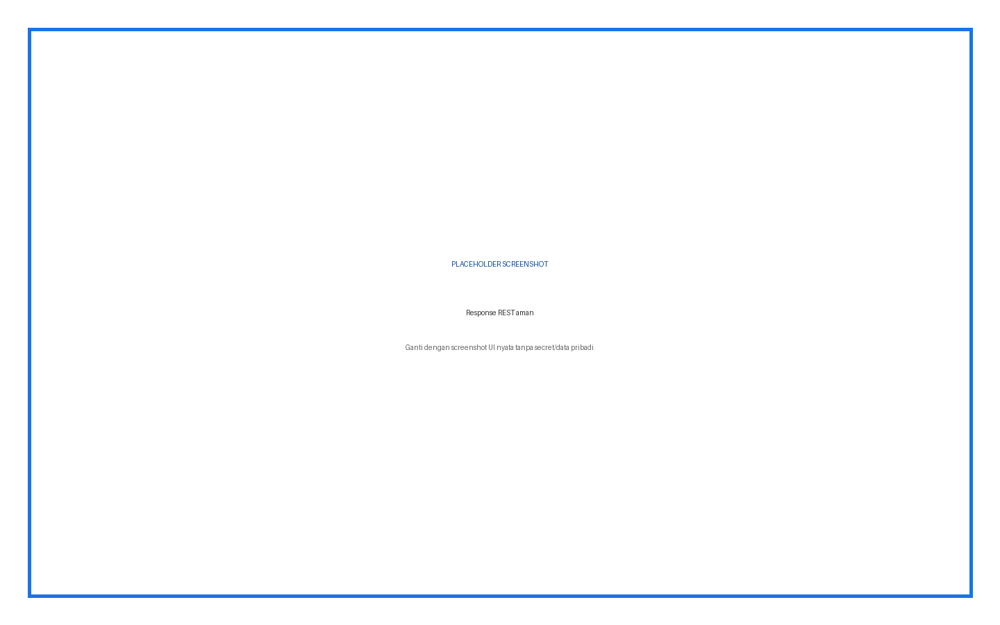

# Quiz Statistics Cache — Panduan Pengguna Lengkap

Plugin mempercepat kalkulasi report Statistics dengan calculator SQL/PHP hybrid dan menulis hasil ke cache Statistics bawaan Moodle.

## Daftar Isi

1. Ringkasan fitur dan role
2. Instalasi
3. Konfigurasi admin
4. Penjelasan setiap input
5. Prosedur penggunaan langkah demi langkah
6. Hasil dan status
7. Troubleshooting
8. Keamanan dan data
9. Versi dan kompatibilitas

## Ringkasan Fitur dan Role

| Role | Fitur |
|---|---|
| Admin | Install, scheduled task, CLI, web service |
| Guru | Recalculate/Force pada report Statistics |
| Peserta | Tidak memakai UI plugin |

## Cara Membaca Panduan

Setiap prosedur menyebut role, lokasi menu, input, fungsi input, langkah, dan hasil yang harus terlihat. Kotak bertuliskan **PLACEHOLDER SCREENSHOT** sengaja disediakan untuk diganti setelah alur UI final difoto.

## Instalasi

**Role:** Administrator situs.

1. Unduh ZIP plugin yang sesuai.
2. Buka **Site administration > Plugins > Install plugins**.
3. Upload ZIP, klik **Install plugin from ZIP file**, lalu lanjutkan validasi.
4. Klik **Upgrade Moodle database now**.
5. Buka **Site administration > Notifications** dan pastikan tidak ada upgrade tertunda.
6. Buka halaman plugin sesuai panduan untuk memastikan menu dan capability terpasang.

> Peringatan: lakukan backup sebelum upgrade production. Jangan menaruh ZIP plugin dengan folder pembungkus ganda.

## Konfigurasi Admin dan Penjelasan Setiap Input

| Input | Tipe/Default | Fungsi | Kapan digunakan |
|---|---|---|---|
| Scheduled task precache_all | Task / setiap 2 jam dari db/tasks.php | Pre-cache quiz yang berubah | Atur via Scheduled tasks |
| getstatslocktimeout | Core Quiz Statistics setting | Timeout lock kalkulasi Statistics | Sesuaikan hanya bila lock timeout terbukti |

## Prosedur Penggunaan Langkah demi Langkah

### Recalculate dari browser

**Role:** Guru

1. Buka quiz dengan finished attempts
2. Pilih Results > Statistics
3. Pastikan kartu Fast Statistics Calculator tampil
4. Klik Recalculate (fast)
5. Tunggu redirect dan notifikasi
6. Periksa angka report Statistics

**Hasil:** Calculator berjalan bila ada perubahan dan menyimpan cache core.

**Gambar 1.** Placeholder — Report Statistics sebelum kalkulasi.

### Force Recalculate

**Role:** Guru/Admin

1. Buka report Statistics
2. Klik Force Recalculate
3. Gunakan hanya setelah quiz edit/grade change atau cache diragukan
4. Tunggu notifikasi waktu dan attempt count
5. Bandingkan hasil dengan data sumber

**Hasil:** Cache dihitung ulang walau change detector tidak menemukan perubahan.

**Gambar 2.** Placeholder — Kartu Fast Statistics Calculator.

### Pre-cache semua quiz

**Role:** Admin

1. Buka terminal sebagai user web server
2. Jalankan `php <Moodle dirroot>/local/quiz_stats_cache/cli/precache.php --fast`
3. Baca jumlah quiz, success, skipped, failed
4. Perbaiki quiz failed lalu ulangi

**Hasil:** Quiz berubah dihitung; yang tidak berubah dilewati.

**Gambar 3.** Placeholder — Notifikasi Recalculate sukses.

### Dry run dan filter CLI

**Role:** Admin

1. Gunakan --dry-run untuk preview
2. Gunakan --quizid=ID untuk satu quiz
3. Gunakan --stale=SECONDS untuk cache berumur tertentu
4. Gunakan --force untuk hitung ulang
5. Jangan menaruh credential dalam command

**Hasil:** CLI memproses scope yang dipilih.

**Gambar 4.** Placeholder — Hasil Statistics core.

### REST API

**Role:** Admin/Integrator

1. Aktifkan web services Moodle secara aman
2. Beri service capability sesuai definisi plugin
3. Panggil local_quiz_stats_cache_get_quiz_stats dengan quizid
4. Validasi cached/message/stats pada JSON
5. Rotasi token bila terekspos

**Hasil:** Client menerima statistik cache sesuai permission.

**Gambar 5.** Placeholder — Scheduled task configuration.

## Opsi CLI Lengkap

| Opsi | Fungsi |
|---|---|
| `--fast` | Menggunakan calculator SQL-based plugin. Tanpa opsi ini script dapat memakai calculator Moodle. |
| `--quizid=ID` | Membatasi ke satu quiz instance ID. |
| `--force` | Mengabaikan change detection. |
| `--stale=SECONDS` | Lewati cache yang lebih baru dari umur tersebut. |
| `--dry-run` | Menampilkan pekerjaan tanpa menghitung/menulis. |
| `--help` | Menampilkan bantuan. |

## Apa yang Ditulis

Calculator menyimpan hasil ke tabel cache Statistics bawaan `quiz_statistics` dan `question_statistics`. Ini bukan report mandiri. Dampak: report Statistics core membaca cache baru. Nilai, jawaban, dan attempt tidak seharusnya diubah oleh kalkulasi, tetapi cache core memang berubah.

## Scheduled Task

Task `local_quiz_stats_cache\task\precache_all` terdaftar melalui `db/tasks.php`. Gunakan **Site administration > Server > Scheduled tasks** untuk melihat jadwal, last run, next run, dan menjalankan task sesuai prosedur Moodle.

## Troubleshooting

| Masalah | Penyebab/Pemeriksaan | Tindakan |
|---|---|---|
| Tombol tidak muncul | Bukan mode statistics/cache JS/capability | Purge cache dan periksa instalasi |
| No data available | Tidak ada finished attempts | Gunakan quiz dengan attempt selesai |
| CLI quiz not found | quizid salah | Gunakan ID instance quiz, bukan cmid |
| Failed pada SQL | DB/function/data tidak mendukung | Periksa error dan kompatibilitas DB |
| Statistik stale | Quiz/grade berubah | Force recalculate |
| Web mode error elapsed | Periksa error runtime pada endpoint | Gunakan CLI dan perbaiki source sebelum production |

## Keamanan dan Data

Jangan menaruh API key, password, token, sesskey, data pribadi, jawaban peserta, atau nilai dalam screenshot dan dokumentasi. Semua write-action harus direview sebelum submit.

## Versi dan Kompatibilitas

local_quiz_stats_cache 2026072000. Requires Moodle 4.1+ (`2022112800`).

**Gambar 6.** Placeholder — Contoh output CLI.

**Gambar 7.** Placeholder — Response REST aman.
