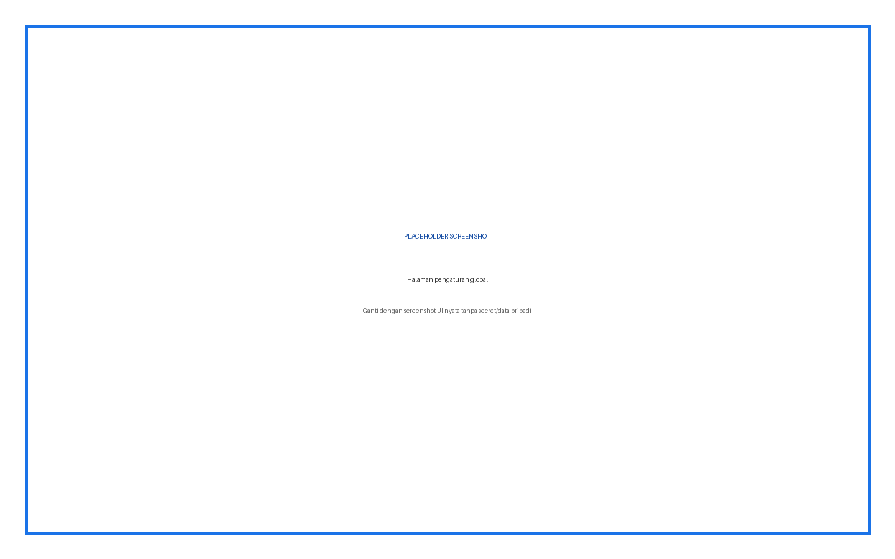
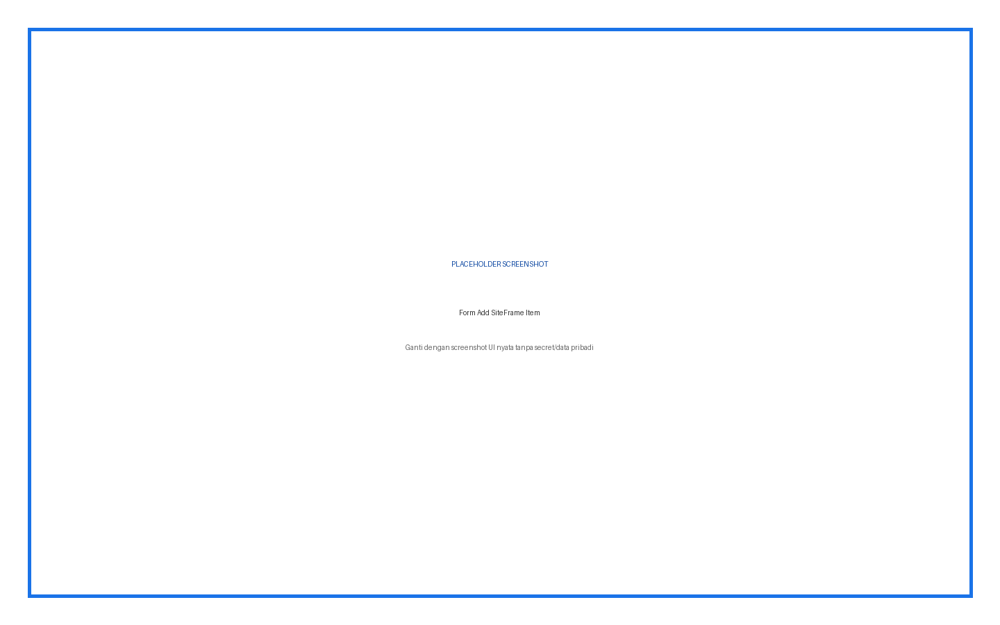
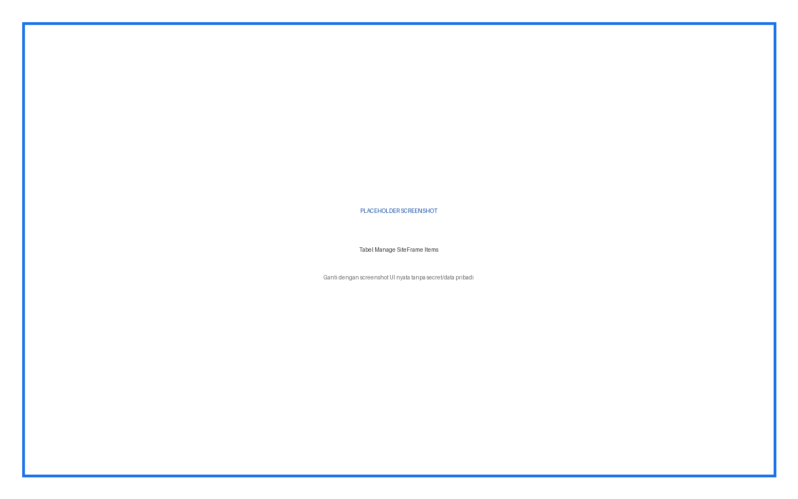
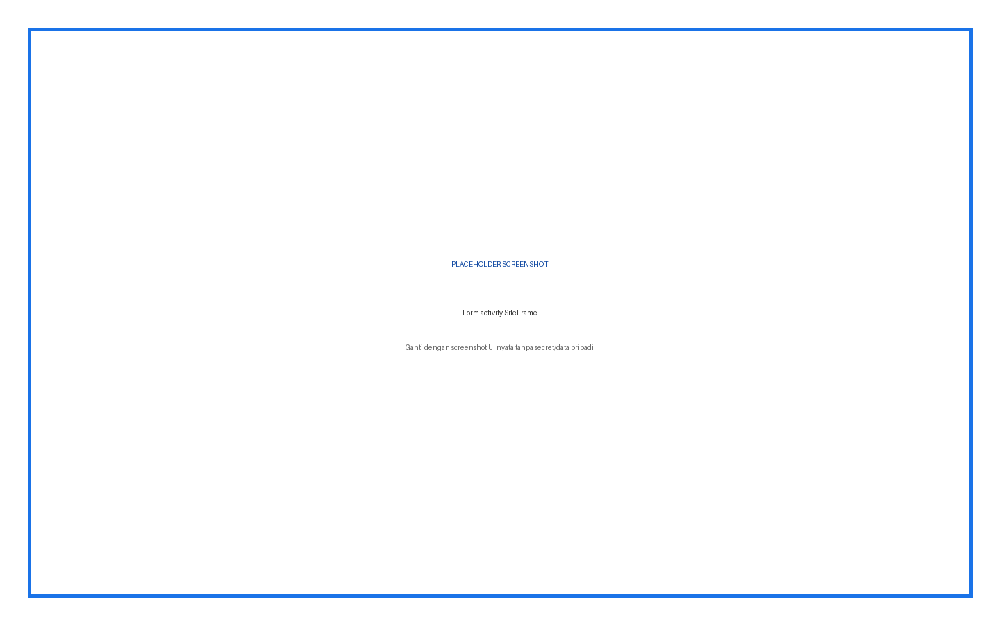
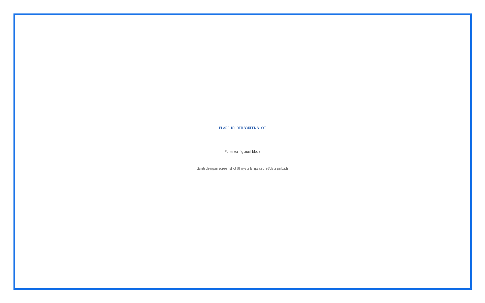
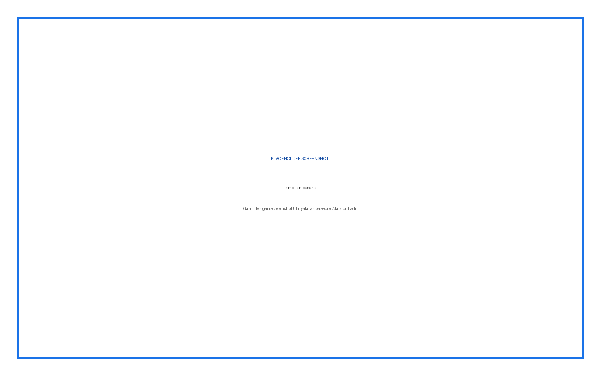

# SiteFrame — Panduan Pengguna Lengkap

Panduan untuk Administrator, Guru/Trainer, dan Peserta. Mencakup `local_siteframe`, `block_siteframe`, dan `mod_siteframe`.

## Daftar Isi

1. Ringkasan fitur
2. Instalasi
3. Konfigurasi global
4. Pengelolaan item
5. Activity SiteFrame
6. Block SiteFrame
7. Pengalaman peserta
8. Troubleshooting
9. Keamanan
10. Versi

## Ringkasan Fitur dan Role

| Fitur | Admin | Guru | Peserta |
|---|---|---|---|
| Mengaktifkan plugin dan mode | Ya | Tidak | Tidak |
| Mengatur allowlist domain | Ya | Tidak | Tidak |
| Mengelola item global/kursus | Ya | Sesuai capability | Tidak |
| Membuat activity dan block | Ya | Ya | Tidak |
| Melihat konten | Ya | Ya | Ya |

## Cara Membaca Panduan

Setiap prosedur menyebut role, lokasi menu, input, fungsi input, langkah, dan hasil yang harus terlihat. Kotak bertuliskan **PLACEHOLDER SCREENSHOT** sengaja disediakan untuk diganti setelah alur UI final difoto.

## Instalasi

**Role:** Administrator situs.

1. Unduh ZIP plugin yang sesuai.
2. Buka **Site administration > Plugins > Install plugins**.
3. Upload ZIP, klik **Install plugin from ZIP file**, lalu lanjutkan validasi.
4. Klik **Upgrade Moodle database now**.
5. Buka **Site administration > Notifications** dan pastikan tidak ada upgrade tertunda.
6. Buka halaman plugin sesuai panduan untuk memastikan menu dan capability terpasang.

> Peringatan: lakukan backup sebelum upgrade production. Jangan menaruh ZIP plugin dengan folder pembungkus ganda.

## Konfigurasi Admin

**Lokasi:** Site administration > Plugins > Local plugins > SiteFrame.

| Input | Tipe | Default | Fungsi | Kapan diubah |
|---|---|---|---|---|
| Enable SiteFrame | Checkbox | Aktif | Sakelar utama local SiteFrame | Nonaktifkan sementara saat maintenance |
| Allowed domains | Textarea | Kosong | Daftar hostname yang boleh di-embed, satu per baris | Isi sebelum production; contoh `docs.example.org` |
| Allow Full Page mode | Checkbox | Aktif | Mengizinkan item membuka halaman mandiri | Matikan bila semua embed harus tetap dalam course |
| Allow Course Page mode | Checkbox | Aktif | Mengizinkan halaman SiteFrame dalam konteks course | Matikan bila navigasi course tidak boleh ditambah |
| Allow Floating Widget mode | Checkbox | Aktif | Mengizinkan item tampil sebagai widget | Matikan bila widget mengganggu UI |
| Allow Modal mode | Checkbox | Aktif | Mengizinkan item modal yang sudah ada | Matikan bila popup tidak diizinkan |
| Widget position | Select | Bottom right | Posisi tombol widget | Pilih posisi yang tidak menutup kontrol tema |
| Widget icon | Text | Globe | Karakter pada tombol | Gunakan karakter sederhana yang didukung font |
| Widget title | Text | SiteFrame | Judul panel widget | Gunakan nama layanan yang dikenali pengguna |
| Sandbox flags | Textarea | allow-scripts allow-same-origin allow-popups | Membatasi kemampuan iframe | Tambah flag hanya bila fitur situs tujuan memerlukannya |

### Penjelasan Setiap Input

## Prosedur Penggunaan Langkah demi Langkah

### Langkah Konfigurasi

1. Aktifkan **Enable SiteFrame**.
2. Isi **Allowed domains** tanpa `https://`, path, atau wildcard.
3. Aktifkan hanya display mode yang diperlukan.
4. Atur posisi, ikon, dan judul widget.
5. Pertahankan sandbox minimum; jangan menambah `allow-top-navigation` tanpa kebutuhan.
6. Klik **Save changes**.
7. Uji satu URL dari allowlist dan satu URL di luar allowlist.

**Gambar 1.** Placeholder — Halaman pengaturan global.

## Mengelola Item SiteFrame

**Lokasi:** Site administration > Plugins > Local plugins > Manage SiteFrame Items.

| Input | Wajib | Fungsi |
|---|---|---|
| Name | Ya | Nama yang tampil pada tabel dan output |
| URL | Ya | Alamat HTTPS konten; harus lolos allowlist |
| Display mode | Ya | Full page, course page, atau widget yang aktif |
| Course | Tidak | Global bila kosong/0; pilih course untuk scope khusus |
| Visible | Tidak | Menampilkan atau menyembunyikan item tanpa menghapus |
| Height | Tidak | Tinggi iframe dalam piksel; 0 memakai perilaku mode |
| Width | Tidak | Lebar CSS, umumnya `100%` |
| Scrolling | Tidak | `auto`, `yes`, atau `no` untuk scrollbar iframe |
| Sort order | Tidak | Urutan numerik item |

### Menambah Item

1. Klik **Add SiteFrame**.
2. Isi nama deskriptif.
3. Tempel URL HTTPS publik.
4. Pilih display mode.
5. Pilih scope global atau course.
6. Aktifkan **Visible**.
7. Buka Advanced; atur height, width, scrolling, sort order.
8. Klik **Save changes**.
9. Pastikan item muncul pada tabel; gunakan **Preview**.

**Gambar 2.** Placeholder — Form Add SiteFrame Item.

### Edit, Visibility, Delete

- **Edit:** ubah field lalu simpan.
- **Disable/Enable:** mengubah visibility tanpa menghapus konfigurasi.
- **Delete:** menghapus item setelah konfirmasi; gunakan hanya jika tidak dibutuhkan.

## Activity SiteFrame

**Role:** Guru dengan edit course.

| Input | Fungsi |
|---|---|
| Name | Nama activity pada halaman course |
| Description | Petunjuk atau konteks bagi peserta |
| URL | Situs yang ditampilkan; divalidasi allowlist |
| Display mode | Inline dalam halaman, Fullscreen, atau Responsive |
| Height | Tinggi iframe; default 600 px |
| Width | Lebar iframe; default 100% |
| Scrolling | Perilaku scrollbar |
| Standard Moodle fields | Visibility, groups, completion, restrictions sesuai core |

1. Nyalakan **Edit mode**.
2. Klik **Add an activity or resource**.
3. Pilih **SiteFrame**.
4. Lengkapi semua field di atas.
5. Klik **Save and display**.
6. Uji sebagai peserta dan pada layar kecil.

**Gambar 3.** Placeholder — Tabel Manage SiteFrame Items.

## Block SiteFrame

1. Nyalakan edit mode dan buka block drawer.
2. Tambah block **SiteFrame**.
3. Buka konfigurasi block.
4. Isi URL, Height, Width, dan Scrolling.
5. Simpan; pastikan domain lolos allowlist dan block tidak menutup konten.

**Gambar 4.** Placeholder — Form activity SiteFrame.

## Hasil bagi Peserta

Peserta hanya melihat iframe/activity/block yang visible dan dapat diakses. Peserta tidak dapat mengganti URL. Jika situs tujuan menolak embedding, browser menampilkan area kosong atau pesan penolakan.

**Gambar 5.** Placeholder — Form konfigurasi block.

## Troubleshooting

| Masalah | Pemeriksaan | Solusi |
|---|---|---|
| Domain not allowed | Hostname pada URL | Tambahkan hostname tepat ke allowlist |
| Iframe kosong | CSP/X-Frame-Options situs tujuan | Gunakan situs yang mengizinkan embedding |
| Mode tidak ada | Toggle mode global | Aktifkan mode lalu simpan |
| Widget ganda ditolak | Item widget aktif pada scope sama | Nonaktifkan item lama |
| Activity tidak muncul | Instalasi dan capability | Pastikan `mod_siteframe` terpasang |
| Block tidak muncul | Instalasi block | Pastikan `block_siteframe` terpasang |

## Keamanan dan Data

Gunakan HTTPS, allowlist sempit, sandbox minimum, dan situs tujuan tepercaya. Iframe dapat menerima metadata jaringan/browser pengguna menurut kebijakan situs eksternal.

## Versi dan Kompatibilitas

- local_siteframe 0.3.0; block_siteframe 0.3.0; mod_siteframe 0.2.0.
- Requires Moodle 4.1+ (`2022112800`).

**Gambar 6.** Placeholder — Tampilan peserta.
