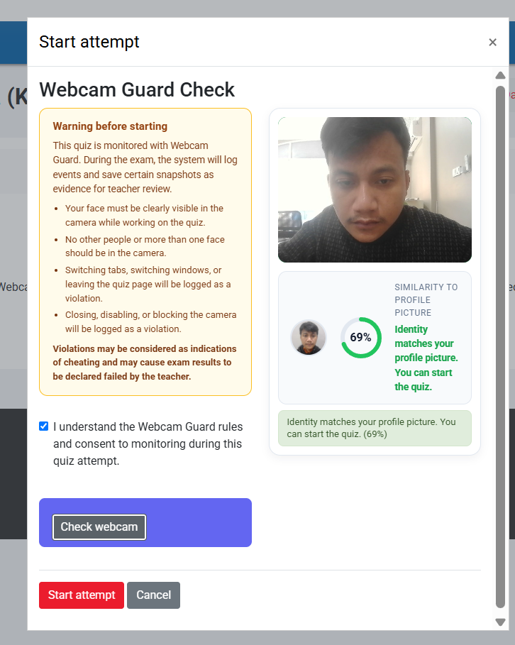
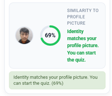
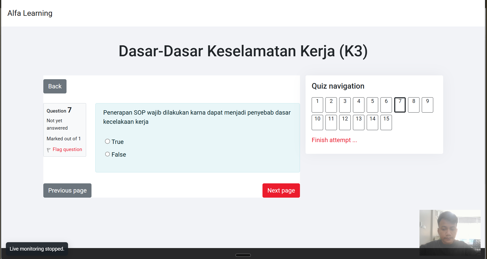
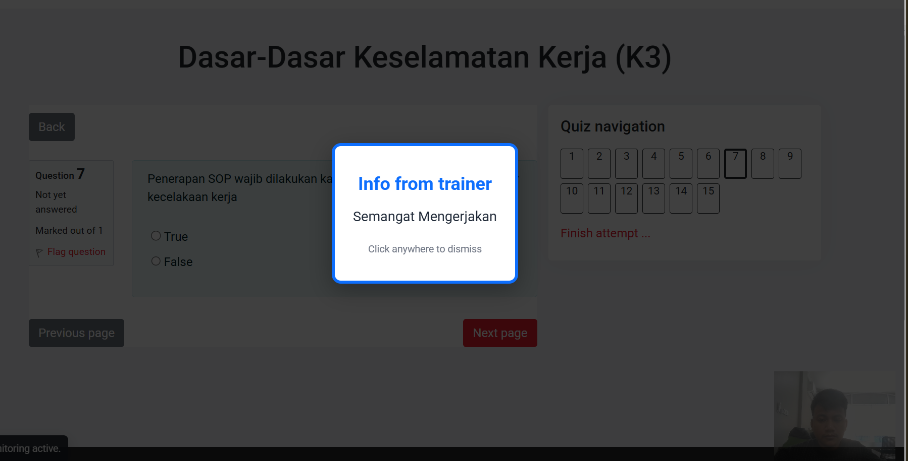
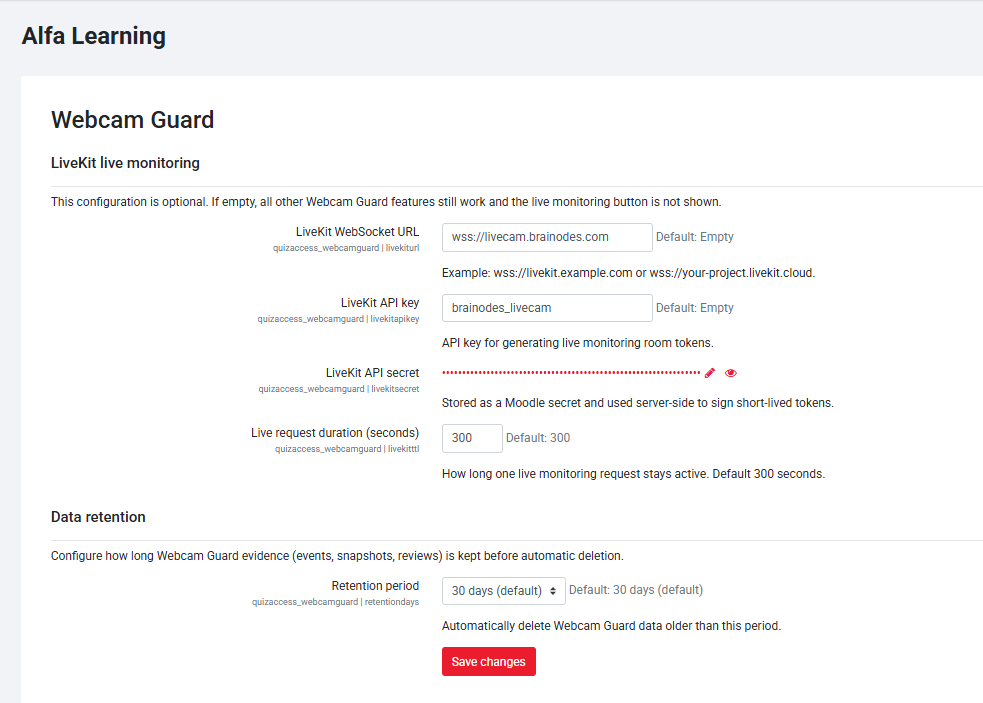
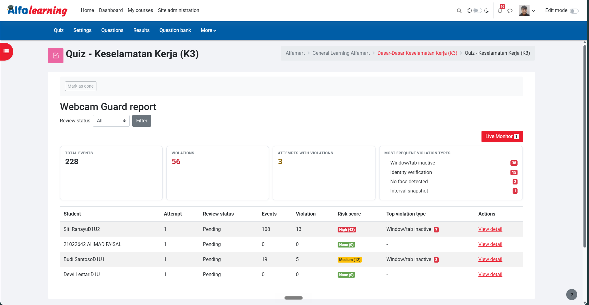
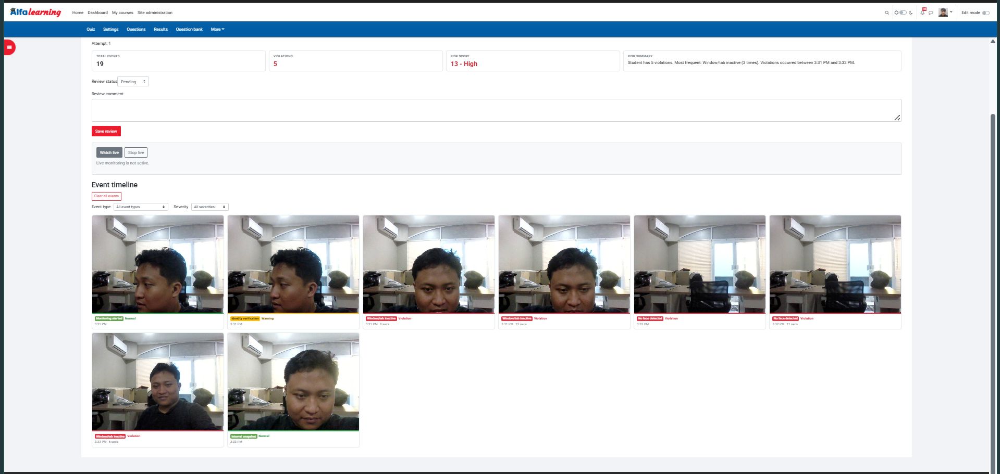
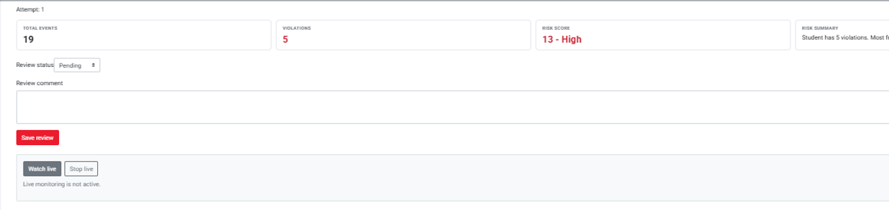
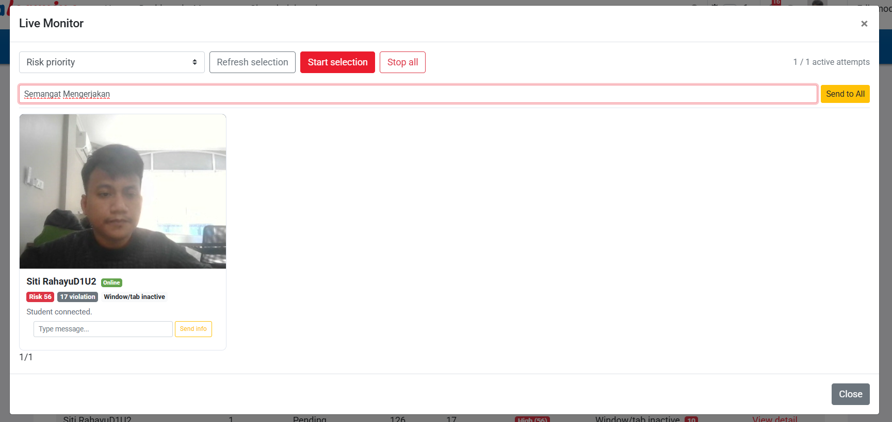

# Webcam Guard — Panduan Pengguna Lengkap

Panduan lengkap untuk **Admin/Trainer** dan **Peserta**.

Versi 0.8.0

---

## Daftar Isi

- [Bagian 1: Untuk Peserta](#bagian-1-untuk-peserta)
  - [1.1 Apa itu Webcam Guard?](#11-apa-itu-webcam-guard)
  - [1.2 Persiapan Sebelum Quiz](#12-persiapan-sebelum-quiz)
  - [1.3 Langkah-Langkah Memulai Quiz](#13-langkah-langkah-memulai-quiz)
  - [1.4 Verifikasi Identitas](#14-verifikasi-identitas)
  - [1.5 Selama Mengerjakan Quiz](#15-selama-mengerjakan-quiz)
  - [1.6 Menerima Info dari Trainer](#16-menerima-info-dari-trainer)
  - [1.7 Menyelesaikan Quiz](#17-menyelesaikan-quiz)
  - [1.8 Yang Boleh dan Tidak Boleh](#18-yang-boleh-dan-tidak-boleh)
  - [1.9 Troubleshooting Peserta](#19-troubleshooting-peserta)
- [Bagian 2: Untuk Admin/Trainer](#bagian-2-untuk-admintrainer)
  - [2.1 Dashboard Webcam Guard](#21-dashboard-webcam-guard)
  - [2.2 Mengaktifkan Webcam Guard di Quiz](#22-mengaktifkan-webcam-guard-di-quiz)
  - [2.3 Penjelasan Setiap Setting](#23-penjelasan-setiap-setting)
  - [2.4 Melihat Report](#24-melihat-report)
  - [2.5 Memahami Risk Score](#25-memahami-risk-score)
  - [2.6 Review Attempt](#26-review-attempt)
  - [2.7 Live Monitoring](#27-live-monitoring)
  - [2.8 Kirim Info ke Peserta](#28-kirim-info-ke-peserta)
  - [2.9 Konfigurasi LiveKit](#29-konfigurasi-livekit)
  - [2.10 Konfigurasi Data Retention](#210-konfigurasi-data-retention)
  - [2.11 Troubleshooting Admin/Trainer](#211-troubleshooting-admintrainer)
- [FAQ](#faq)

---

# Bagian 1: Untuk Peserta

## 1.1 Apa itu Webcam Guard?

Webcam Guard adalah sistem pengawasan otomatis yang digunakan saat Anda mengerjakan quiz online. Sistem ini bekerja dengan cara:

1. **Mengaktifkan webcam** Anda selama mengerjakan quiz
2. **Mendeteksi wajah** Anda di kamera secara otomatis setiap 1 detik
3. **Mengambil foto (snapshot)** jika terdeteksi pelanggaran
4. **Mencatat semua aktivitas** sebagai bukti untuk review trainer
5. **Mengizinkan trainer mengirim info** langsung ke layar Anda

**Yang TIDAK dilakukan Webcam Guard:**
- ❌ Tidak merekam video secara terus-menerus
- ❌ Tidak mengakses file di komputer/HP Anda
- ❌ Tidak mengambil alih layar komputer Anda
- ❌ Tidak memblokir Anda dari quiz (kecuali mode Block untuk identitas)
- ❌ Tidak mengintip aktivitas di luar browser

---

## 1.2 Persiapan Sebelum Quiz

Sebelum membuka quiz yang menggunakan Webcam Guard, pastikan semua hal berikut sudah siap:

### Di Komputer/Laptop:

| No | Persiapan | Cara Mengecek |
|----|-----------|---------------|
| 1 | **Webcam terpasang** | Buka aplikasi Camera di komputer, pastikan gambar muncul |
| 2 | **Browser terbaru** | Chrome 90+, Edge 90+, Firefox 90+, atau Safari 15+ |
| 3 | **Koneksi internet stabil** | Pastikan WiFi/kabel tidak putus-putus |
| 4 | **Pencahayaan cukup** | Wajah harus terlihat jelas, hindari backlight |
| 5 | **Tutup aplikasi webcam lain** | Tutup Zoom, Teams, Google Meet, dll |
| 6 | **Foto profil Moodle** | Jika diminta verifikasi identitas, upload foto profil terlebih dahulu |

### Di HP/Smartphone:

| No | Persiapan | Cara Mengecek |
|----|-----------|---------------|
| 1 | **Kamera depan aktif** | Pastikan menggunakan kamera depan (bukan belakang) |
| 2 | **Browser terbaru** | Chrome atau Safari versi terbaru |
| 3 | **Layar cukup besar** | Disarankan minimal 5 inci |
| 4 | **Posisi tegak** | Pegang HP secara vertikal |
| 5 | **Pencahayaan dari depan** | Jangan backlight (cahaya dari belakang) |

### Tips Pencahayaan:

```
❌ SALAH                          ✅ BENAR

  [Lampu] → [Anda] → [Kamera]     [Kamera] ← [Anda] ← [Lampu]
  (backlight, wajah gelap)         (frontlight, wajah terang)
```

---

## 1.3 Langkah-Langkah Memulai Quiz

### Langkah 1: Buka Quiz

1. Login ke Moodle
2. Buka mata kuliah yang memiliki quiz
3. Klik nama quiz yang akan dikerjakan
4. Anda akan melihat halaman informasi quiz

### Langkah 2: Jendela Pemeriksaan Webcam Muncul

Setelah mengklik **"Attempt quiz"** atau **"Mulai attempt"**, jendela pemeriksaan webcam akan muncul:



Jendela ini menampilkan:
- **Peringatan** tentang aturan Webcam Guard
- **Checkbox persetujuan** yang harus dicentang
- **Preview kamera** (kosong pada awalnya)
- **Tombol "Periksa webcam"**

### Langkah 3: Centang Persetujuan

1. Baca semua aturan yang tertera
2. **Centang checkbox** "Saya memahami aturan Webcam Guard"
3. Checkbox ini wajib dicentang sebelum bisa melanjutkan

### Langkah 4: Izinkan Akses Kamera

1. Klik tombol **"Periksa webcam"**
2. Browser akan meminta izin akses kamera
3. Klik **"Izinkan"** (Allow) di dialog browser

**Di Chrome:**
```
┌─────────────────────────────────────┐
│ 📷 localhost:8080 wants to          │
│    use your camera                  │
│                                     │
│    [Block]        [Allow]           │
└─────────────────────────────────────┘
```

**Di Firefox:**
```
┌─────────────────────────────────────┐
│ 📷 Will you allow localhost:8080    │
│    to use your camera?              │
│                                     │
│    [Don't Allow]    [Allow]         │
└─────────────────────────────────────┘
```

### Langkah 5: Webcam Aktif

Setelah izin diberikan:
1. **Preview kamera** akan muncul di jendela pemeriksaan
2. Pastikan **wajah Anda terlihat jelas** di preview
3. Jika verifikasi identitas aktif, **lingkaran similarity** akan muncul

### Langkah 6: Verifikasi Identitas (Jika Diaktifkan)

Jika trainer mengaktifkan verifikasi identitas:



1. Sistem akan **membandingkan wajah** Anda di webcam dengan foto profil Moodle
2. **Lingkaran similarity** menunjukkan persentase kecocokan
3. **Border kamera** akan berubah warna:
   - 🟣 **Ungu berkedip**: Sedang mencari wajah
   - 🟢 **Hijau**: Wajah cocok
   - 🔴 **Merah**: Wajah tidak cocok
4. Tunggu hingga **status berubah** menjadi "cocok" atau "tidak cocok"

### Langkah 7: Mulai Quiz

1. Jika semua pemeriksaan sudah selesai, klik **"Start attempt"** atau **"Mulai attempt"**
2. Quiz akan terbuka dan Anda bisa mulai mengerjakan

**Catatan Penting:**
- Jika mode **"Flag"**: Anda tetap bisa mulai quiz meskipun identitas tidak cocok, tapi akan ditandai di report
- Jika mode **"Block"**: Anda harus cocok dulu sebelum bisa mulai

---

## 1.4 Verifikasi Identitas

### Cara Kerja Verifikasi Identitas

1. Sistem mengambil **foto dari webcam** Anda
2. Sistem memuat **foto profil Moodle** Anda
3. Sistem **membandingkan kedua wajah** menggunakan teknologi face recognition
4. Sistem menghitung **persentase kecocokan** (0-100%)
5. Jika kecocokan di atas threshold (default 60%), dianggap cocok

### Status Verifikasi

| Status | Border Kamera | Arti |
|--------|---------------|------|
| 🟣 Mencari | Ungu berkedip | Sedang mencari wajah di kamera |
| 🟢 Cocok | Hijau | Wajah cocok dengan foto profil |
| 🔴 Tidak cocok | Merah | Wajah tidak cocok dengan foto profil |

### Jika Foto Profil Belum Diupload

Jika Anda belum upload foto profil Moodle:
1. Sistem akan menampilkan **peringatan** bahwa foto profil diperlukan
2. Klik link **"Upload foto profil"** untuk membuka halaman edit profil
3. Upload foto wajah yang jelas
4. Kembali ke quiz dan klik **"Periksa webcam"** lagi

---

## 1.5 Selama Mengerjakan Quiz

### Apa yang Dipantau?

Selama Anda mengerjakan quiz, sistem akan memantau:

| No | Apa yang Dipantau | Kapan Dianggap Pelanggaran | Contoh Situasi |
|----|-------------------|---------------------------|----------------|
| 1 | **Wajah tidak terlihat** | Lebih dari 10 detik | Melihat ke bawah terlalu lama, wajah keluar frame |
| 2 | **Lebih dari satu wajah** | Lebih dari 3 detik | Ada orang lain di belakang Anda |
| 3 | **Pindah tab/window** | Lebih dari 5 detik | Buka Google, buka aplikasi lain |
| 4 | **Kamera mati/blokir** | Langsung dicatat | Menutup kamera, memblokir akses kamera |

**Catatan:** Threshold waktu bisa diatur oleh trainer, jadi bisa berbeda di setiap quiz.

### Preview Kamera

Selama quiz, Anda akan melihat **preview kecil** di pojok kanan bawah layar:



- Preview berukuran **kecil** (sekitar 160px)
- Preview **transparan** (opacity 75%)
- Preview **tidak mengganggu** pengerjaan quiz
- Preview hanya untuk **memastikan webcam aktif**

### Apa yang Terjadi Saat Pelanggaran?

1. Sistem **mengambil foto** dari webcam Anda
2. Event **dicatat** di server dengan timestamp
3. Trainer bisa melihat di **report** (tidak real-time, tapi setelah quiz selesai)
4. **Tidak ada notifikasi** yang muncul di layar Anda saat pelanggaran biasa
5. **Info dari trainer** bisa muncul jika trainer mengirimnya (lihat bagian 1.6)

---

## 1.6 Menerima Info dari Trainer

### Kapan Info Muncul?

Selama mengerjakan quiz, trainer dapat mengirim **info langsung** ke layar Anda. Info ini biasanya dikirim ketika:
- Trainer melihat pelanggaran berulang
- Trainer ingin mengingatkan Anda tentang aturan
- Trainer ingin memberikan instruksi khusus

### Seperti Apa Info-nya?



Info muncul sebagai:
- **Overlay full-screen** dengan latar belakang gelap
- **Border merah** di sekeliling pesan
- **Teks pesan** dari trainer
- **Keterangan** "Klik di mana saja untuk menutup"

### Cara Menutup Info

1. **Klik di mana saja** pada overlay untuk menutup
2. Atau **tunggu 30 detik** — info akan hilang otomatis
3. Setelah ditutup, info **tidak akan muncul lagi** (bersifat satu kali)

### Apa yang Harus Dilakukan Saat Menerima Info?

1. **Jangan panik** — info bukan hukuman
2. **Baca pesan** dengan teliti
3. **Perbaiki perilaku** yang diminta oleh trainer
4. **Klik untuk menutup** info
5. **Lanjutkan quiz** seperti biasa

**Contoh Pesan Info:**
- "Tolong fokus ke layar, terdeteksi wajah tidak terlihat beberapa kali"
- "Pastikan tidak ada orang lain di belakang Anda"
- "Jangan pindah tab selama mengerjakan quiz"

---

## 1.7 Menyelesaikan Quiz

Setelah selesai mengerjakan quiz:

1. Klik **"Finish attempt"** atau **"Selesai"**
2. Konfirmasi penyelesaian quiz
3. Webcam akan **otomatis berhenti** setelah quiz selesai
4. Semua data monitoring **tersimpan otomatis** di server
5. Anda bisa **menutup browser** setelah quiz selesai

**Catatan:**
- Data monitoring **disimpan selama 30 hari** (default, bisa diatur trainer)
- Setelah 30 hari, data akan **dihapus otomatis**
- Trainer bisa **mereview** data Anda kapan saja selama periode tersebut

---

## 1.8 Yang Boleh dan Tidak Boleh

### ✅ Yang Boleh Dilakukan

- Mengerjakan quiz seperti biasa
- Sesekali melihat ke bawah (membaca soal di layar)
- Minum air
- Posisi normal di depan komputer/HP
- Menggerakkan kepala sedikit (wajah tetap terlihat)
- Menggunakan kacamata (selama wajah tetap terlihat)

### ❌ Yang Harus Dihindari

- **Pindah ke tab/aplikasi lain** — akan dicatat sebagai pelanggaran
- **Menutup atau memblokir kamera** — akan dicatat sebagai pelanggaran
- **Ada orang lain di kamera** — akan dicatat sebagai pelanggaran
- **Menutup browser** — quiz mungkin tidak tersimpan
- **Mematikan komputer/HP** — quiz mungkin tidak tersimpan
- **Menggunakan virtual background** — bisa mengganggu deteksi wajah
- **Menggunakan kacamata hitam** — bisa mengganggu deteksi wajah

### 💡 Tips untuk Hasil Terbaik

1. **Gunakan Chrome atau Edge** untuk performa terbaik
2. **Di HP, gunakan kamera depan** dan pastikan wajah terlihat
3. **Pastikan pencahayaan dari depan** (bukan dari belakang)
4. **Jangan gunakan virtual background** — bisa mengganggu deteksi wajah
5. **Posisikan kamera sejajar mata** — jangan terlalu atas atau bawah
6. **Jaga jarak 30-50cm** dari kamera — tidak terlalu dekat atau jauh
7. **Jika webcam error, refresh halaman** dan coba lagi

---

## 1.9 Troubleshooting Peserta

### Masalah: "Webcam tidak ditemukan"

**Penyebab:** Browser tidak bisa mengakses webcam.

**Solusi:**
1. Pastikan webcam **terpasang dengan benar** (di laptop, cek apakah kamera tertutup)
2. **Tutup aplikasi lain** yang menggunakan webcam (Zoom, Teams, Google Meet, dll)
3. Buka **pengaturan browser** → izin kamera → pastikan situs Moodle diizinkan
4. **Refresh halaman** quiz
5. Jika masih gagal, **restart browser**
6. Jika masih gagal, **coba browser lain** (Chrome direkomendasikan)

### Masalah: "Izin kamera ditolak"

**Penyebab:** Anda menolak izin akses kamera.

**Solusi:**
1. Klik **icon 🔒 atau 📷** di address bar browser (sebelah kiri URL)
2. Ubah izin kamera dari "Block" ke **"Allow"**
3. **Refresh halaman** quiz
4. Klik **"Periksa webcam"** lagi

### Masalah: "Identity does not match"

**Penyebab:** Wajah di webcam tidak cocok dengan foto profil.

**Solusi:**
1. Pastikan **foto profil Moodle** sudah diupload (bukan foto default)
2. Pastikan **pencahayaan cukup terang** — wajah harus terlihat jelas
3. **Posisikan wajah di tengah** kamera
4. **Jangan gunakan kacamata hitam** atau aksesoris yang menutupi wajah
5. Jika mode **"Flag"**: Anda tetap bisa mulai quiz
6. Jika mode **"Block"**: hubungi trainer Anda untuk bantuan

### Masalah: Preview kamera tidak muncul

**Penyebab:** Webcam aktif tapi tidak ada gambar.

**Solusi:**
1. Cek **koneksi internet** — pastikan stabil
2. Coba **browser lain** (Chrome direkomendasikan)
3. **Restart browser** dan coba lagi
4. **Restart komputer/HP** jika masih gagal
5. Hubungi **helpdesk IT** jika masalah berlanjut

### Masalah: Info dari trainer muncul terus

**Penyebab:** Trainer mengirim info karena melihat pelanggaran.

**Solusi:**
1. **Baca pesan info** dengan teliti
2. **Perbaiki perilaku** yang diminta oleh trainer
3. Info hanya muncul **satu kali per pengiriman**
4. Jika merasa info tidak tepat, **hubungi trainer** setelah quiz selesai
5. **Jangan mengabaikan info** — ini adalah komunikasi dari trainer

### Masalah: Quiz terasa lambat

**Penyebab:** Webcam monitoring menggunakan resource komputer/HP.

**Solusi:**
1. **Tutup tab/aplikasi lain** yang tidak diperlukan
2. **Tutup program berat** (video editing, game, dll)
3. Gunakan **komputer/HP yang lebih bertenaga** jika memungkinkan
4. **Restart browser** sebelum mulai quiz

---

# Bagian 2: Untuk Admin/Trainer

## 2.1 Dashboard Webcam Guard

### Apa itu Dashboard?

Dashboard adalah halaman ringkasan yang menampilkan **semua quiz** di mata kuliah Anda yang menggunakan Webcam Guard. Dari dashboard, Anda bisa:
- Melihat ringkasan semua quiz
- Mengakses report per quiz
- Memantau aktivitas monitoring

### Cara Mengakses Dashboard

1. Buka **mata kuliah** yang memiliki quiz dengan Webcam Guard
2. Di menu navigasi course, klik **"Webcam Guard Dashboard"**
3. Atau: buka salah satu quiz → klik **"View Webcam Guard report"**

### Apa yang Ditampilkan Dashboard?

| Kolom | Keterangan |
|-------|-----------|
| **Nama Quiz** | Nama quiz dengan Webcam Guard aktif |
| **Total Events** | Jumlah event monitoring yang tercatat |
| **Total Violations** | Jumlah pelanggaran yang terdeteksi |
| **Attempts with Violations** | Jumlah attempt yang punya pelanggaran |
| **Actions** | Link ke report detail per quiz |

---

## 2.2 Mengaktifkan Webcam Guard di Quiz

### Langkah-Langkah

1. **Login** ke Moodle sebagai admin/trainer
2. Buka **mata kuliah** yang ingin diatur
3. Klik **nama quiz** yang ingin diawasi
4. Klik **"Settings"** di menu quiz
5. Scroll ke bawah ke bagian **"Webcam Guard"**
6. **Centang "Enable Webcam Guard"**
7. Atur setting sesuai kebutuhan (lihat bagian 2.3)
8. Klik **"Save and return to course"** atau **"Save changes"**



---

## 2.3 Penjelasan Setiap Setting

### Setting Utama

| Setting | Default | Keterangan |
|---------|---------|-----------|
| **Enable Webcam Guard** | ❌ Nonaktif | Aktifkan/nonaktifkan monitoring untuk quiz ini |
| **Capture snapshot on violation** | ✅ Aktif | Ambil foto saat pelanggaran terdeteksi |

### Setting Interval

| Setting | Default | Keterangan |
|---------|---------|-----------|
| **Interval snapshots** | Off | Ambil foto berkala selama quiz (bukan hanya saat pelanggaran) |
| | Off | Tidak ada foto berkala |
| | Every 60 seconds | Ambil foto setiap 60 detik |
| | Every 120 seconds | Ambil foto setiap 120 detik |
| | Every 300 seconds | Ambil foto setiap 300 detik |

### Setting Threshold

| Setting | Default | Keterangan |
|---------|---------|-----------|
| **No-face threshold** | 10 detik | Berapa lama wajah tidak terdeteksi sebelum dianggap pelanggaran |
| **Multiple-face threshold** | 3 detik | Berapa lama lebih dari satu wajah sebelum dianggap pelanggaran |
| **Tab/window blur threshold** | 5 detik | Berapa lama pindah tab/window sebelum dianggap pelanggaran |

**Tips Threshold:**
- **Threshold rendah** (3-5 detik): Lebih ketat, lebih banyak pelanggaran terdeteksi
- **Threshold tinggi** (15-30 detik): Lebih longgar, hanya pelanggaran serius yang terdeteksi
- **Disarankan**: Gunakan default untuk quiz biasa, sesuaikan untuk quiz penting

### Setting Live Monitoring

| Setting | Default | Keterangan |
|---------|---------|-----------|
| **Enable optional live monitoring** | ❌ Nonaktif | Izinkan trainer meminta streaming webcam live dari peserta |

**Catatan:** Live monitoring memerlukan konfigurasi LiveKit (lihat bagian 2.9).

### Setting Identitas

| Setting | Default | Keterangan |
|---------|---------|-----------|
| **Verify identity with profile picture** | ❌ Nonaktif | Aktifkan verifikasi wajah dengan foto profil |
| **Identity match threshold** | 60 | Nilai 30-90. Semakin kecil, semakin ketat |
| **If identity does not match** | Flag | Flag: tandai di report. Block: halangi mulai quiz |

**Tips Threshold Identitas:**
- **30-40**: Sangat ketat — hanya wajah yang sangat mirip yang cocok
- **50-60**: Sedang — cocok untuk kebanyakan kasus
- **70-90**: Longgar — wajah yang agak mirip pun dianggap cocok

---

## 2.4 Melihat Report

### Langkah-Langkah Membuka Report

1. Buka **quiz** yang menggunakan Webcam Guard
2. Di halaman quiz, klik **"View Webcam Guard report"**
3. Atau: Quiz → Administration → Webcam Guard report



### Apa yang Ditampilkan Report?

#### Summary Cards (Kartu Ringkasan)

| Kartu | Keterangan |
|-------|-----------|
| **Total Events** | Jumlah total event monitoring |
| **Total Violations** | Jumlah total pelanggaran |
| **Attempts with Violations** | Jumlah attempt yang punya pelanggaran |
| **Top Violations** | Jenis pelanggaran yang paling sering terjadi |

#### Tabel Review

| Kolom | Keterangan |
|-------|-----------|
| **Student** | Nama peserta |
| **Attempt** | Nomor attempt |
| **Status** | Status review (Pending/Cleared/Suspicious) |
| **Events** | Jumlah event monitoring |
| **Violation** | Jumlah pelanggaran |
| **Risk Score** | Skor risiko (semakin tinggi semakin berisiko) |
| **Top Violation Type** | Jenis pelanggaran terbanyak |
| **Actions** | Link ke detail attempt |

### Filter Status

Gunakan dropdown filter di atas tabel untuk memfilter berdasarkan status:

| Filter | Keterangan |
|--------|-----------|
| **All** | Semua attempt (default) |
| **Pending** | Belum direview oleh trainer |
| **Cleared** | Sudah dinilai aman oleh trainer |
| **Suspicious** | Dicurigai kecurangan oleh trainer |

---

## 2.5 Memahami Risk Score

### Apa itu Risk Score?

Risk score adalah **skor numerik** yang menunjukkan tingkat risiko kecurangan berdasarkan pelanggaran yang tercatat. Semakin tinggi skor, semakin berisiko.

### Cara Perhitungan Risk Score

Setiap jenis pelanggaran memiliki bobot:

| Jenis Pelanggaran | Bobot | Keterangan |
|-------------------|-------|-----------|
| **No face** | 2 poin | Wajah tidak terlihat |
| **Multiple faces** | 4 poin | Lebih dari satu wajah |
| **Window blur** | 3 poin | Pindah tab/window |
| **Camera stopped** | 5 poin | Kamera berhenti/mati |
| **Camera error** | 3 poin | Error kamera |
| **Identity check** | 4 poin | Identitas tidak cocok |

**Contoh Perhitungan:**
- Peserta A: 3× no_face (3×2=6) + 1× window_blur (1×3=3) = **Risk Score 9**
- Peserta B: 1× camera_stopped (1×5=5) + 2× multiple_faces (2×4=8) = **Risk Score 13**

### Level Risiko

| Score | Level | Warna | Interpretasi |
|-------|-------|-------|-------------|
| 0 | **Aman** | 🟢 Hijau | Tidak ada pelanggaran |
| 1-4 | **Rendah** | 🔵 Biru | Pelanggaran minor, kemungkinan tidak disengaja |
| 5-12 | **Sedang** | 🟡 Kuning | Perlu diperhatikan, mungkin ada masalah |
| 13+ | **Tinggi** | 🔴 Merah | Perlu review serius, kemungkinan kecurangan |

**Catatan Penting:** Risk score adalah **indikator**, bukan bukti. Selalu review foto dan timeline sebelum mengambil keputusan.

---

## 2.6 Review Attempt

### Langkah-Langkah Review

1. Di halaman report, klik **"View detail"** pada attempt yang ingin direview
2. Anda akan melihat halaman detail attempt



### Apa yang Ditampilkan di Halaman Detail?

#### Summary Cards

| Kartu | Keterangan |
|-------|-----------|
| **Total Events** | Jumlah event untuk attempt ini |
| **Total Violations** | Jumlah pelanggaran untuk attempt ini |
| **Risk Score** | Skor risiko untuk attempt ini |

#### Risk Summary

Teks ringkasan yang menjelaskan:
- Jumlah total pelanggaran
- Jenis pelanggaran terbanyak
- Rentang waktu pelanggaran terjadi

#### Event Timeline

Grid kartu yang menampilkan setiap event:
- **Badge**: jenis event (No face, Multiple faces, dll)
- **Status**: Normal (hijau), Warning (kuning), Violation (merah)
- **Foto**: snapshot yang diambil (jika ada)
- **Waktu**: kapan event terjadi

**Klik kartu** untuk melihat detail lengkap termasuk metadata.

### Memberikan Review



1. Di bagian bawah halaman detail, Anda akan melihat **form review**
2. Pilih **status review**:
   - **Pending**: belum diputuskan (default)
   - **Cleared**: dianggap aman, tidak ada masalah
   - **Suspicious**: dicurigai kecurangan, perlu tindak lanjut
3. Tulis **komentar** (opsional): catatan untuk referensi Anda
4. Klik **"Save review"**
5. Status akan tersimpan dan bisa diubah kapan saja

---

## 2.7 Live Monitoring

### Apa itu Live Monitoring?

Live monitoring memungkinkan Anda **melihat webcam peserta secara langsung** selama mereka mengerjakan quiz. Fitur ini menggunakan teknologi **LiveKit** (WebRTC) untuk streaming video real-time.

### Prasyarat

1. **LiveKit harus dikonfigurasi** oleh admin site (lihat bagian 2.9)
2. **Quiz settings** → "Enable optional live monitoring" harus dicentang
3. Peserta harus sedang **aktif mengerjakan quiz** (di halaman attempt)

### Langkah-Langkah Live Monitoring

#### Langkah 1: Buka Live Monitor

1. Buka **Webcam Guard report**
2. Klik tombol **"Live Monitor"** di bagian atas
3. Modal Live Monitor akan terbuka



#### Langkah 2: Pilih Mode Filter

Gunakan dropdown filter untuk memilih peserta yang ingin dimonitor:

| Mode | Keterangan |
|------|-----------|
| **Prioritas risiko** | Urutkan dari risk score tertinggi (default) |
| **Hanya yang ada violation** | Filter yang punya pelanggaran |
| **Kamera bermasalah** | Filter camera_stopped/error |
| **Belum pernah dicek** | Yang belum pernah dimonitor live |
| **Risk tinggi** | Filter risk score 13+ |
| **Risk sedang** | Filter risk score 5-12 |
| **Risk rendah** | Filter risk score 1-4 |
| **Semua attempt aktif** | Tampilkan semua |
| **Acak 20 peserta** | Pilih 20 secara acak |

#### Langkah 3: Mulai Monitoring

1. Klik **"Start pilihan"** untuk mulai monitoring semua peserta yang tampil
2. Atau klik tombol **"Start"** di tile peserta individual
3. Tunggu hingga **status berubah** dari "Menyiapkan..." ke "Tersambung"
4. Video webcam peserta akan muncul di tile

#### Langkah 4: Memantau Peserta

Setiap tile menampilkan:
- **Video webcam** peserta secara langsung
- **Nama peserta** dengan badge Online/Offline
- **Risk score** dan jumlah violation
- **Jenis violation terbanyak**
- **Status terakhir** (event terakhir yang tercatat)
- **Input untuk mengirim info**

#### Langkah 5: Berhenti Monitoring

1. Klik **"Stop"** di tile peserta individual untuk berhenti
2. Atau klik **"Stop semua"** untuk berhenti semua
3. Atau **tutup modal** Live Monitor — semua koneksi akan terputus otomatis

### Indikator Online/Offline

Setiap tile menampilkan badge status:

| Badge | Warna | Arti |
|-------|-------|------|
| **Online** | 🟢 Hijau | Peserta sedang aktif — ada monitoring event dalam 60 detik terakhir |
| **Offline** | ⚪ Abu-abu | Peserta tidak aktif — tidak ada event baru |

**Catatan:** Peserta harus sedang **membuka halaman quiz** agar statusnya Online. Jika peserta menutup browser atau pindah tab terlalu lama, statusnya akan berubah ke Offline.

### Auto-Reorder (Pengurutan Otomatis)

Tile peserta **otomatis diurutkan** berdasarkan risk score:
- **Risk tertinggi** → pojok kiri atas
- **Risk terendah** → pojok kanan bawah
- Urutan **berubah otomatis** setiap 4 detik saat polling
- **Video stream tetap jalan** saat tile bergeser posisi

### Navigasi Halaman

Jika peserta lebih dari 20, dashboard menampilkan **navigasi halaman**:
- **Prev / Next** untuk berpindah halaman
- **"X / Y active attempts"** menunjukkan range yang ditampilkan

---

## 2.8 Kirim Info ke Peserta

### Kirim Info ke Satu Peserta

1. Buka **Live Monitor** (lihat bagian 2.7)
2. Di setiap tile peserta, ada **input teks** di bagian bawah
3. **Ketik pesan info** yang ingin dikirim
4. Klik **"Send"**
5. Pesan akan muncul sebagai **overlay di layar peserta**

### Kirim Info ke Semua Peserta

1. Buka **Live Monitor**
2. Di bagian **atas dashboard**, ada bar **"Kirim Info ke Semua"**
3. **Ketik pesan info** yang ingin dikirim
4. Klik **"Kirim ke Semua"**
5. Pesan akan dikirim ke **semua peserta yang tampil di grid** (sesuai filter aktif)

### Tips Kirim Info

- **Gunakan filter** sebelum kirim ke semua — misal filter "Hanya yang ada violation" untuk mengingatkan hanya yang melanggar
- **Pesan yang jelas** — contoh: "Tolong fokus ke layar, terdeteksi wajah tidak terlihat"
- **Info bersifat satu kali** — peserta bisa dismiss dengan klik atau tunggu 30 detik
- **Gunakan dengan bijak** — terlalu banyak info bisa mengganggu konsentrasi peserta

---

## 2.9 Konfigurasi LiveKit

### Apa itu LiveKit?

LiveKit adalah platform WebRTC open-source yang digunakan Webcam Guard untuk streaming video real-time antara peserta dan trainer.

### Langkah-Langkah Konfigurasi

#### Langkah 1: Buat Akun LiveKit

1. Buka https://cloud.livekit.io/
2. Buat akun atau login
3. Buat project baru
4. Catat **WebSocket URL**, **API Key**, dan **API Secret**

#### Langkah 2: Masukkan Konfigurasi di Moodle

1. Buka **Site administration** → **Module settings** → **Webcam Guard**
2. Masukkan **LiveKit WebSocket URL** (contoh: wss://livekit.example.com)
3. Masukkan **LiveKit API Key**
4. Masukkan **LiveKit API Secret**
5. Atur **Token TTL** (default: 300 detik)
6. Klik **"Save changes"**

#### Langkah 3: Aktifkan di Quiz

1. Buka quiz settings
2. Centang **"Enable optional live monitoring"**
3. Simpan quiz

---

## 2.10 Konfigurasi Data Retention

### Apa itu Data Retention?

Data retention adalah **pengaturan berapa lama data monitoring disimpan** sebelum dihapus otomatis. Ini termasuk:
- Event monitoring
- Snapshot/foto
- Data review
- Data live monitoring

### Cara Mengatur

1. Buka **Site administration** → **Module settings** → **Webcam Guard**
2. Cari bagian **"Data retention"**
3. Pilih **periode retensi**:
   - 7 hari
   - 14 hari
   - 30 hari (default)
   - 60 hari
   - 90 hari
   - 180 hari
   - 365 hari (1 tahun)
4. Klik **"Save changes"**

**Catatan:** Data yang sudah dihapus tidak bisa dikembalikan. Pilih periode yang sesuai dengan kebutuhan.

---

## 2.11 Troubleshooting Admin/Trainer

### Masalah: Report kosong / tidak ada data

**Solusi:**
1. Pastikan **Webcam Guard enabled** di quiz settings
2. Pastikan ada peserta yang **sudah mulai attempt**
3. Cek **filter status** → coba "All"
4. Tunggu beberapa menit setelah peserta mulai quiz
5. Cek apakah quiz menggunakan **HTTPS** (bukan HTTP)

### Masalah: Snapshot tidak muncul

**Solusi:**
1. Cek quiz settings → **"Capture snapshot on violation"** centang
2. Cek apakah peserta menggunakan **HTTPS**
3. Cek apakah browser peserta mendukung **getUserMedia**
4. Cek **disk space** server Moodle

### Masalah: Live monitoring tidak bisa

**Solusi:**
1. Cek **LiveKit config** di Site administration (URL, API key, secret)
2. Cek quiz settings → **"Enable optional live monitoring"** centang
3. Cek capability Anda → harus punya `quizaccess/webcamguard:viewreport`
4. Cek apakah ada peserta yang sedang **aktif mengerjakan** (badge Online)

### Masalah: Start live monitoring tidak nyambung

**Solusi:**
1. Pastikan peserta sedang **membuka halaman quiz** (badge harus Online)
2. Jika peserta Offline, minta mereka **refresh halaman quiz**
3. Cek **LiveKit config** (URL, API key, secret)
4. Cek **browser console** untuk error WebRTC
5. Pastikan **firewall** tidak memblokir koneksi WebRTC

### Masalah: Risk score 0 tapi ada pelanggaran

**Penjelasan:** Risk score 0 berarti tidak ada event dengan severity "violation". Event "info" atau "warning" tidak menambah score.

**Solusi:**
1. Cek apakah **threshold** terlalu tinggi
2. Cek apakah **"Capture snapshot on violation"** aktif
3. Cek **event timeline** untuk melihat detail event

---

# FAQ

## Untuk Peserta

**Q: Apakah webcam saya direkam?**
A: Tidak. Hanya foto (snapshot) yang diambil saat pelanggaran terdeteksi. Tidak ada video yang direkam.

**Q: Berapa lama data disimpan?**
A: Tergantung setting admin, default 30 hari. Bisa diatur dari 7 hari hingga 365 hari.

**Q: Apakah saya bisa menolak webcam?**
A: Jika quiz menggunakan Webcam Guard, Anda harus mengizinkan webcam untuk bisa mengerjakan quiz.

**Q: Apakah foto saya dilihat oleh semua orang?**
A: Tidak. Hanya admin/trainer yang mengampu mata kuliah tersebut yang bisa melihat.

**Q: Apa yang terjadi jika saya menerima info dari trainer?**
A: Info muncul sebagai overlay di layar Anda. Baca pesan, perbaiki perilaku yang diminta, lalu klik untuk menutup. Info tidak mempengaruhi nilai atau status quiz Anda.

**Q: Apakah bisa mengerjakan quiz di HP?**
A: Ya, Webcam Guard mendukung HP (Android dan iOS). Pastikan kamera depan aktif dan pencahayaan cukup.

**Q: Apa yang terjadi jika saya pindah tab sebentar?**
A: Pindah tab kurang dari threshold (default 5 detik) tidak dianggap pelanggaran. Lebih dari threshold akan dicatat.

**Q: Apakah saya bisa melihat data monitoring saya?**
A: Tidak secara langsung. Data hanya bisa dilihat oleh admin/trainer melalui Moodle Privacy API.

## Untuk Admin/Trainer

**Q: Apakah saya bisa mengubah setting setelah quiz dimulai?**
A: Setting bisa diubah, tapi hanya berlaku untuk attempt baru. Attempt yang sudah berjalan tetap menggunakan setting lama.

**Q: Apakah Webcam Guard bisa mendeteksi kecurangan?**
A: Webcam Guard adalah alat bantu, bukan pengganti penilaian manusia. Selalu review foto dan konteks sebelum mengambil keputusan.

**Q: Berapa banyak attempt yang bisa dimonitor live?**
A: Maksimal 20 attempt per halaman. Gunakan navigasi halaman untuk melihat lebih banyak.

**Q: Apakah data bisa di-export?**
A: Ya, melalui Moodle Privacy API (Site administration → Privacy).

**Q: Apakah info yang saya kirim akan hilang setelah refresh?**
A: Ya, info bersifat sekali kirim. Setelah peserta dismiss atau 30 detik berlalu, info hilang.

**Q: Bagaimana cara tahu peserta sedang aktif?**
A: Lihat badge **Online** (hijau) di tile peserta di Live Monitor. Online = ada monitoring event dalam 60 detik terakhir.

**Q: Apakah saya perlu mengkonfigurasi LiveKit?**
A: Hanya jika ingin menggunakan fitur live monitoring. Semua fitur lain (monitoring, snapshot, review) tidak memerlukan LiveKit.

**Q: Berapa ukuran maksimal snapshot?**
A: 2MB per snapshot. Snapshot dikompres ke JPEG dengan kualitas 72%.

**Q: Apakah monitoring berjalan di background?**
A: Tidak. Monitoring hanya berjalan selama peserta **membuka halaman quiz**. Jika peserta menutup browser, monitoring berhenti.
